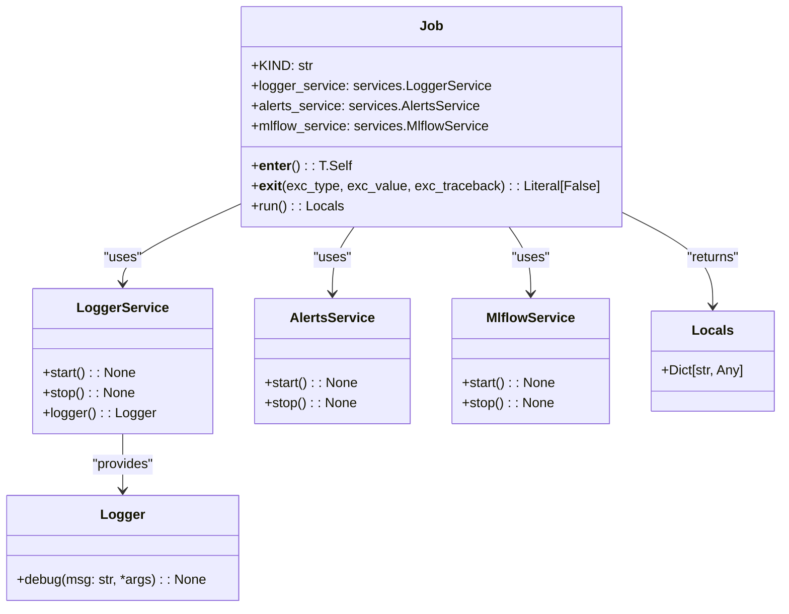

# US [High-Level Project Jobs](./backlog_mlops_regresion.md) : Manage the execution context for high-level project jobs with integrated services.

- [US High-Level Project Jobs : Manage the execution context for high-level project jobs with integrated services.](#us-high-level-project-jobs--manage-the-execution-context-for-high-level-project-jobs-with-integrated-services)
  - [classes relations](#classes-relations)
  - [**User Stories: Job Management**](#user-stories-job-management)
    - [**1. User Story: Manage Job Execution Context**](#1-user-story-manage-job-execution-context)
    - [**2. User Story: Facilitate Logging**](#2-user-story-facilitate-logging)
    - [**3. User Story: Facilitate Alerts Management**](#3-user-story-facilitate-alerts-management)
    - [**4. User Story: Facilitate MLflow Tracking Management**](#4-user-story-facilitate-mlflow-tracking-management)
    - [**Common Acceptance Criteria**](#common-acceptance-criteria)
    - [**Definition of Done (DoD):**](#definition-of-done-dod)
  - [Code location](#code-location)
  - [Test location](#test-location)

------------

## classes relations

## **User Stories: Job Management**

---

### **1. User Story: Manage Job Execution Context**

**Title:**  
As a **developer**, I want to define a context for executing high-level jobs, so that proper setup and teardown procedures for integrated services are followed.

**Description:**  
The `Job` class serves as a base for executing high-level project jobs while managing the lifecycle of various services, including logging, alerts, and MLflow tracking. By using context management, it ensures that services are correctly initialized and cleaned up.

**Acceptance Criteria:**  
- The `__enter__` method initializes relevant services when entering the context.
- The `__exit__` method cleans up and stops services when exiting the context.
- Exceptions that occur during execution are properly propagated.

---

### **2. User Story: Facilitate Logging**

**Title:**  
As a **developer**, I want to integrate a logging service within my job context, so that I can monitor the job execution process through logs.

**Description:**  
The `logger_service` attribute of the `Job` class allows for logging messages during the execution of the job, enabling visibility into the processing stages.

**Acceptance Criteria:**  
- Logging is initialized as soon as a job context is entered.
- Log messages provide insights into the status of services being used (logger service, alerts service, MLflow service).
- Cleanup of the logging service occurs upon exit of the job context.

---

### **3. User Story: Facilitate Alerts Management**

**Title:**  
As a **developer**, I want to manage an alerts service during job execution, so that important events or errors can be communicated as notifications.

**Description:**  
The `alerts_service` attribute allows the job to manage notifications regarding alerting mechanisms, keeping the user informed about crucial events.

**Acceptance Criteria:**  
- The alerts service is started when entering the job context.
- Notifications related to the job execution can be triggered through the alerts service.
- The alerts service is stopped appropriately after job execution.

---

### **4. User Story: Facilitate MLflow Tracking Management**

**Title:**  
As a **data scientist**, I want to integrate MLflow tracking during job execution, so I can automatically log models, parameters, and metrics to the MLflow server.

**Description:**  
The `mlflow_service` attribute enables the job to track experiments and model metrics, making it easier to analyze the performance of various models.

**Acceptance Criteria:**  
- The MLflow service should be started in the job context, allowing active tracking of the job.
- All relevant information logged during job execution should be captured via MLflow.
- The MLflow service should be stopped properly when exiting the context.

---

### **Common Acceptance Criteria**

1. **Implementation Requirements:**
   - The `Job` class is abstract and cannot be instantiated directly; all subclasses must implement the `run` method.
   - The context management methods (`__enter__`, `__exit__`) must be properly implemented.

2. **Error Handling:**
   - Any exceptions triggered in the context must be captured and logged appropriately, ensuring they propagate upwards for further handling.

3. **Testing:**
   - Unit tests validate the context management behavior, ensuring services are started and stopped correctly without leaks or errors.
   - Tests check the logging output and alert notifications during execution.

4. **Documentation:**
   - Each class and method should have clear docstrings explaining their purpose and usage.
   - Examples of extending the Job class for specific job implementations should be included.

---

### **Definition of Done (DoD):** 

- The `Job` class is fully implemented with the required methods.
- Subclasses of `Job` are created and demonstrate expected behavior during execution.
- All functionality has been tested and passes the relevant unit tests.
- Documentation is comprehensive, with clear examples for users.

## Code location

[src/model_name/jobs/base.py](../src/model_name/jobs/base.py)

## Test location

[tests/jobs/test_base.py](../tests/jobs/test_base.py)
