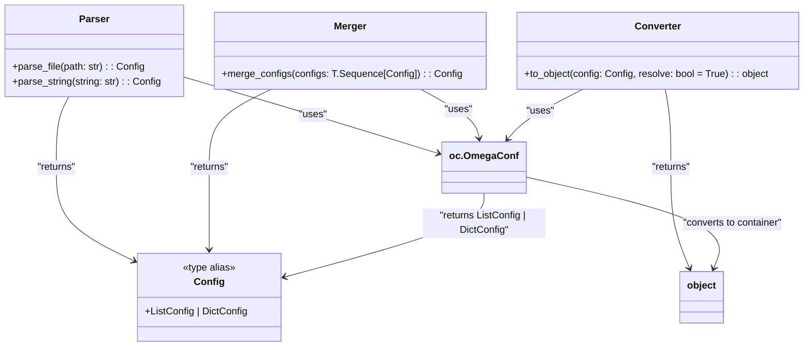

# US [Configs](./backlog_mlops_regresion.md) : Parse, Merge, and Convert Configuration Objects

- [US Configs : Parse, Merge, and Convert Configuration Objects](#us-configs--parse-merge-and-convert-configuration-objects)
  - [methods uml diagram](#methods-uml-diagram)
  - [**1.  User Story: Parse Configuration File**](#1--user-story-parse-configuration-file)
  - [**2. User Story: Parse Configuration String**](#2-user-story-parse-configuration-string)
  - [**3. User Story: Merge Multiple Configurations**](#3-user-story-merge-multiple-configurations)
  - [**4. User Story: Convert Configuration to Python Object**](#4-user-story-convert-configuration-to-python-object)
  - [**Common Acceptance Criteria Across All Stories**](#common-acceptance-criteria-across-all-stories)
  - [**Definition of Done (DoD):**](#definition-of-done-dod)
  - [Code location](#code-location)
  - [Test location](#test-location)

---
## methods uml diagram

## **1.  User Story: Parse Configuration File**

**Title:**  
As a **developer**, I want to parse configuration files from a specified path so that I can load application settings dynamically.

**Description:**  
The `parse_file` function allows developers to load a configuration file located at a given file path. This enables flexible management of settings across various environments.

**Acceptance Criteria:**  

- The function accepts a string path to the configuration file.
- It returns an `OmegaConf` configuration object representing the file contents.
- If the file path is invalid or the file format is unsupported, it raises an appropriate error.

---

## **2. User Story: Parse Configuration String**

**Title:**  
As a **developer**, I want to parse configuration strings so that I can dynamically create configuration objects from text.

**Description:**  
The `parse_string` function allows developers to create a configuration object directly from a string input. This is useful for testing or dynamically generating configurations.

**Acceptance Criteria:**  

- The function accepts a string representing the configuration content.
- It returns an `OmegaConf` configuration object.
- If the string is malformed or invalid, an appropriate error is raised.

---

## **3. User Story: Merge Multiple Configurations**

**Title:**  
As a **developer**, I want to merge multiple configuration objects so that I can combine settings from different sources into a single configuration.

**Description:**  
The `merge_configs` function merges a sequence of `OmegaConf` configuration objects into one, ensuring no conflicting or redundant settings across configurations.

**Acceptance Criteria:**  

- The function accepts a sequence of `OmegaConf` configuration objects.
- It returns a single merged configuration object.
- Conflicting keys are resolved using `OmegaConf`'s merging logic.
- If the input is empty or contains invalid types, an appropriate error is raised.

---

## **4. User Story: Convert Configuration to Python Object**

**Title:**  
As a **developer**, I want to convert configuration objects into Python-native data structures so that I can work with them directly in my code.

**Description:**  
The `to_object` function converts an `OmegaConf` configuration object into standard Python data structures like dictionaries or lists, enabling easy interaction and manipulation.

**Acceptance Criteria:**  

- The function accepts an `OmegaConf` configuration object and an optional `resolve` flag (default: `True`).
- It returns the configuration as a Python object (e.g., dictionary, list).
- If `resolve=True`, variables within the configuration are resolved before conversion.
- If the configuration object is invalid, an appropriate error is raised.

---

## **Common Acceptance Criteria Across All Stories**

- The functions are tested with various input scenarios, including valid, invalid, and edge cases.
- Documentation is provided for each function, including usage examples.
- Errors and exceptions are properly handled, with meaningful error messages for developers.
- All functions are integrated into the broader configuration management system of the application.

---

## **Definition of Done (DoD):**

- All functions (`parse_file`, `parse_string`, `merge_configs`, `to_object`) are implemented and tested.
- Unit tests cover valid, invalid, and edge cases.
- Documentation includes clear examples and explanations for each function.
- Functions are robust, handling errors gracefully with meaningful messages.
- Code passes peer review and adheres to the project's coding standards.

## Code location

[src/model_name/core/schemas.py](../src/model_name/io/configs.py)

## Test location

[tests/core/test_schemas.py](../tests/io/configs.py)