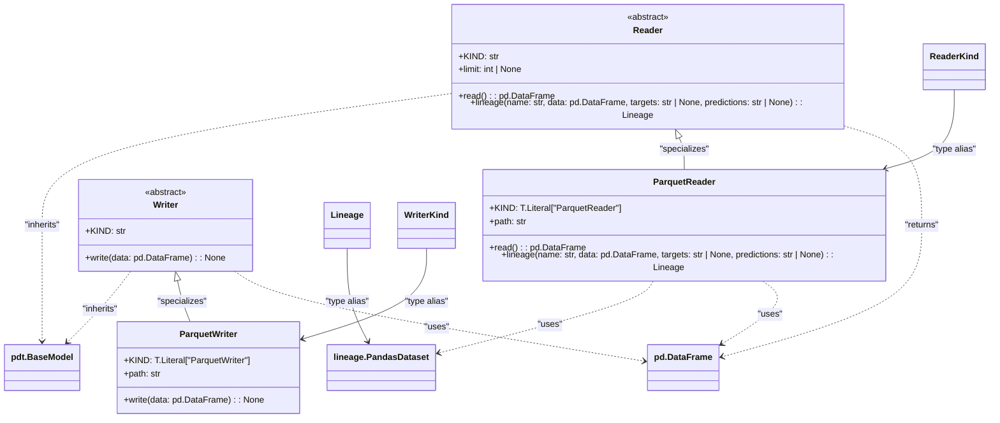

# US [Datasetes](./backlog_mlops_regresion.md) :  Handle loading, preprocessing, and managing data sets for training, evaluation, and inference.

- [US Datasetes :  Handle loading, preprocessing, and managing data sets for training, evaluation, and inference.](#us-datasetes---handle-loading-preprocessing-and-managing-data-sets-for-training-evaluation-and-inference)
  - [classes relations](#classes-relations)
  - [**User Stories: Dataset Reader and Lineage Generator**](#user-stories-dataset-reader-and-lineage-generator)
    - [**1. User Story: Load Dataset into Memory**](#1-user-story-load-dataset-into-memory)
    - [**2. User Story: Generate Lineage Information**](#2-user-story-generate-lineage-information)
    - [**Common Acceptance Criteria**](#common-acceptance-criteria)
    - [**Definition of Done (DoD):**](#definition-of-done-dod)
  - [**User Stories: ParquetReader Implementation**](#user-stories-parquetreader-implementation)
    - [**1. User Story: Load DataFrame from Parquet File**](#1-user-story-load-dataframe-from-parquet-file)
    - [**2. User Story: Generate Lineage Metadata for Parquet Datasets**](#2-user-story-generate-lineage-metadata-for-parquet-datasets)
    - [**Common Acceptance Criteria**](#common-acceptance-criteria-1)
    - [**Example Use Cases**](#example-use-cases)
    - [**Definition of Done (DoD):**](#definition-of-done-dod-1)
  - [**User Stories: Writer and ParquetWriter Implementation**](#user-stories-writer-and-parquetwriter-implementation)
    - [**1. User Story: Save DataFrame to Storage**](#1-user-story-save-dataframe-to-storage)
    - [**2. User Story: Save DataFrame to Parquet Format**](#2-user-story-save-dataframe-to-parquet-format)
    - [**Common Acceptance Criteria**](#common-acceptance-criteria-2)
    - [**Example Use Cases**](#example-use-cases-1)
    - [**Definition of Done (DoD):**](#definition-of-done-dod-2)
  - [Code location](#code-location)
  - [Test location](#test-location)

------------

## classes relations


## **User Stories: Dataset Reader and Lineage Generator**

---

### **1. User Story: Load Dataset into Memory**

**Title:**  
As a **data scientist**, I want to load datasets into memory using a standardized reader so that I can access the data for analysis and model training.

**Description:**  
The `Reader` class provides a base implementation for loading datasets into a Pandas DataFrame from various sources (e.g., files, databases, or cloud storage). This ensures consistent data handling across the project.

**Acceptance Criteria:**  
- The reader supports loading datasets into a Pandas DataFrame.
- The `limit` parameter can restrict the number of rows read (optional).
- The `read` method is abstract and must be implemented by subclasses to support specific data sources.
- The returned DataFrame adheres to the schema defined by the dataset source.

---

### **2. User Story: Generate Lineage Information**

**Title:**  
As a **data engineer**, I want to generate lineage information for datasets so that I can track their origin and transformations for compliance and debugging purposes.

**Description:**  
The `lineage` method generates metadata describing the dataset's origin, target columns, and prediction columns. This enables better tracking and reproducibility in the machine learning workflow.

**Acceptance Criteria:**  
- The `lineage` method accepts the following parameters:
  - `name`: The name of the dataset.
  - `data`: The DataFrame representation of the dataset.
  - `targets`: (Optional) The name of the target column(s).
  - `predictions`: (Optional) The name of the prediction column(s).
- The method returns a `PandasDataset` object containing lineage metadata.
- Subclasses of `Reader` implement the method to ensure lineage tracking is specific to their data source.

---

### **Common Acceptance Criteria**

1. **Implementation Requirements:**
   - The `Reader` class is abstract and cannot be instantiated directly.
   - Subclasses must implement both the `read` and `lineage` methods.

2. **Error Handling:**
   - If the `read` method is not implemented in a subclass, an appropriate error is raised.
   - If `lineage` parameters (e.g., `data`, `name`) are invalid or missing, the method raises an informative error.

3. **Testing:**
   - Unit tests for the `Reader` base class validate correct implementation by subclasses.
   - Tests cover various data sources and edge cases, such as large datasets, missing parameters, and invalid configurations.

4. **Documentation:**
   - Clear docstrings and examples are provided for both the `read` and `lineage` methods.
   - The purpose and usage of the `limit`, `targets`, and `predictions` parameters are well-documented.

---

### **Definition of Done (DoD):**

- The `Reader` class and all required methods are implemented with clear documentation.
- Subclasses of `Reader` are tested for different data sources (e.g., file, database, cloud).
- The `lineage` method generates correct and complete metadata.
- Code adheres to the project’s coding standards and passes peer review.
- Unit tests cover a wide range of scenarios and achieve high test coverage.
- Documentation includes usage examples for developers and data scientists.


## **User Stories: ParquetReader Implementation**

---

### **1. User Story: Load DataFrame from Parquet File**

**Title:**  
As a **data scientist**, I want to load datasets stored in Parquet format into a Pandas DataFrame so that I can analyze and process them in memory.

**Description:**  
The `ParquetReader` class provides functionality to read data from Parquet files and return it as a Pandas DataFrame. It ensures compatibility with modern data storage formats and supports optional row limits.

**Acceptance Criteria:**  
- The `read` method reads the dataset from the specified Parquet file path.
- If a `limit` is provided, the number of rows in the DataFrame is capped accordingly.
- The method raises an informative error if the file path is invalid or the file format is unsupported.
- The returned DataFrame matches the content and structure of the original Parquet file.

---

### **2. User Story: Generate Lineage Metadata for Parquet Datasets**

**Title:**  
As a **data engineer**, I want to generate lineage metadata for datasets read from Parquet files so that I can track their origin and ensure reproducibility.

**Description:**  
The `lineage` method generates metadata describing the dataset's source, name, and optional target or prediction columns. This metadata integrates with lineage tracking tools for debugging and audit trails.

**Acceptance Criteria:**  
- The `lineage` method accepts the following parameters:
  - `name`: The logical name of the dataset.
  - `data`: The Pandas DataFrame representation of the dataset.
  - `targets`: (Optional) The name of the target column(s).
  - `predictions`: (Optional) The name of the prediction column(s).
- The method leverages the `lineage.from_pandas` function to create a `PandasDataset` object.
- The `source` attribute in the metadata corresponds to the Parquet file path.

---

### **Common Acceptance Criteria**

1. **Implementation Requirements:**
   - The `ParquetReader` class extends the `Reader` base class.
   - The `KIND` attribute is set to `"ParquetReader"` for identification.

2. **Error Handling:**
   - The `read` method raises an error if the file does not exist or is not a valid Parquet file.
   - The `lineage` method validates the presence and correctness of the input parameters (e.g., `name`, `data`).

3. **Testing:**
   - Unit tests for `read` verify correct data loading, row limiting, and error scenarios (e.g., missing or invalid files).
   - Unit tests for `lineage` validate proper metadata generation and integration with lineage tracking tools.

4. **Documentation:**
   - Clear docstrings are provided for the `ParquetReader` class and its methods.
   - Examples include loading a dataset and generating lineage metadata for tracking.

---

### **Example Use Cases**

1. **Load and Limit Rows:**
   ```python
   reader = ParquetReader(path="data/dataset.parquet", limit=1000)
   data = reader.read()
   print(data.head())
   ```

2. **Generate Lineage Metadata:**
   ```python
   reader = ParquetReader(path="data/dataset.parquet")
   data = reader.read()
   lineage_info = reader.lineage(name="My Dataset", data=data, targets="target_column")
   print(lineage_info)
   ```

---

### **Definition of Done (DoD):**

- The `ParquetReader` class is implemented with the `read` and `lineage` methods.
- The class passes all unit tests, including edge cases and error handling.
- The `lineage` metadata integrates seamlessly with lineage tracking tools.
- Documentation and usage examples are complete and accessible to developers and data scientists.


## **User Stories: Writer and ParquetWriter Implementation**

---

### **1. User Story: Save DataFrame to Storage**

**Title:**  
As a **data engineer**, I want to save a Pandas DataFrame to a specified location so that I can persist my data for later use or sharing.

**Description:**  
The `Writer` base class defines an abstract interface for saving datasets to various storage backends (e.g., file systems, databases, cloud storage). Implementations of this class, like the `ParquetWriter`, provide specific functionality to save data in a defined format.

**Acceptance Criteria:**  
- The `Writer` class defines an abstract `write` method to be implemented by subclasses.
- Subclasses specify the `KIND` attribute to identify the type of writer.
- Documentation exists for how to extend the `Writer` class for other formats or storage solutions.

---

### **2. User Story: Save DataFrame to Parquet Format**

**Title:**  
As a **data scientist**, I want to save a Pandas DataFrame as a Parquet file so that I can efficiently store and retrieve large datasets.

**Description:**  
The `ParquetWriter` class provides functionality to save a DataFrame in Parquet format to a local or remote path. This ensures compatibility with modern analytics workflows and data pipelines.

**Acceptance Criteria:**  
- The `ParquetWriter` class:
  - Inherits from the `Writer` base class.
  - Implements the `write` method to save a DataFrame to a Parquet file.
  - Accepts a `path` parameter specifying the storage location (local or S3).
- The `write` method:
  - Calls `pd.DataFrame.to_parquet()` to perform the save operation.
  - Overwrites existing files at the specified path.
- The method raises an error if:
  - The path is invalid or inaccessible.
  - The data cannot be serialized to Parquet format.
- The Parquet file is written with the structure and content of the provided DataFrame.

---

### **Common Acceptance Criteria**

1. **Implementation Requirements:**
   - The `Writer` class is abstract and enforces implementation of the `write` method in subclasses.
   - The `ParquetWriter` class sets its `KIND` attribute to `"ParquetWriter"` for identification.

2. **Error Handling:**
   - The `write` method raises informative errors for invalid paths, permissions issues, or serialization problems.
   - Validation ensures the `data` argument is a valid Pandas DataFrame.

3. **Testing:**
   - Unit tests verify:
     - Successful writing of DataFrames to Parquet files.
     - Handling of edge cases like empty DataFrames or invalid paths.
   - Tests mock file paths and S3 URLs for isolated functionality.

4. **Documentation:**
   - Clear docstrings are provided for the `Writer` and `ParquetWriter` classes.
   - Usage examples include writing data to both local and S3 paths.

---

### **Example Use Cases**

1. **Write DataFrame to Local Path:**
   ```python
   writer = ParquetWriter(path="data/output.parquet")
   writer.write(data=df)
   ```

2. **Write DataFrame to S3 Path:**
   ```python
   writer = ParquetWriter(path="s3://my-bucket/output.parquet")
   writer.write(data=df)
   ```

---

### **Definition of Done (DoD):**

- The `Writer` and `ParquetWriter` classes are implemented and adhere to the design principles.
- The `write` method in `ParquetWriter` successfully saves DataFrames in Parquet format.
- All functionality is tested with unit tests, including error scenarios.
- Documentation is complete, with clear instructions for usage and extensibility.

## Code location

[src/model_name/core/schemas.py](../src/model_name/io/datasets.py)

## Test location

[tests/core/test_schemas.py](../tests/io/datasets.py)
