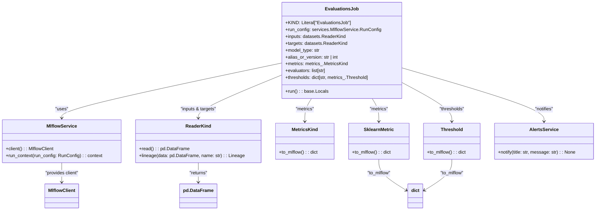

# US [Model Evaluation Job](./backlog_mlops_regresion.md) : Define a job for evaluating registered models with given datasets.

- [US Model Evaluation Job : Define a job for evaluating registered models with given datasets.](#us-model-evaluation-job--define-a-job-for-evaluating-registered-models-with-given-datasets)
  - [classes relations](#classes-relations)
  - [**User Stories: Evaluation Job Management**](#user-stories-evaluation-job-management)
    - [**1. User Story: Configure Evaluation Job**](#1-user-story-configure-evaluation-job)
    - [**2. User Story: Read Input and Target Data**](#2-user-story-read-input-and-target-data)
    - [**3. User Story: Log Data Lineage**](#3-user-story-log-data-lineage)
    - [**4. User Story: Evaluate Model Against Data**](#4-user-story-evaluate-model-against-data)
    - [**5. User Story: Notify Completion of Evaluations**](#5-user-story-notify-completion-of-evaluations)
    - [**Common Acceptance Criteria**](#common-acceptance-criteria)
    - [**Definition of Done (DoD):**](#definition-of-done-dod)
  - [Code location](#code-location)
  - [Test location](#test-location)

------------

## classes relations

## **User Stories: Evaluation Job Management**

---

### **1. User Story: Configure Evaluation Job**

**Title:**  
As a **data scientist**, I want to configure an evaluation job that sets up necessary parameters for evaluating a registered model against a dataset, so that I can assess model performance.

**Description:**  
The `EvaluationsJob` class allows for setting up parameters such as input data readers, target data readers, model type, model version, and evaluation metrics. 

**Acceptance Criteria:**  
- The job can be initialized with necessary parameters (e.g., model type, input readers, metrics).
- Default values are provided for optional parameters.

---

### **2. User Story: Read Input and Target Data**

**Title:**  
As a **data engineer**, I want to read input and target datasets from specified sources, so that I can use them for model evaluation.

**Description:**  
The `run` method in the `EvaluationsJob` class reads input and target datasets using the designated data readers and checks them against predefined schemas to ensure data integrity.

**Acceptance Criteria:**  
- The job reads inputs and targets from their respective sources.
- Data shape and integrity checks are performed before proceeding with evaluations.

---

### **3. User Story: Log Data Lineage**

**Title:**  
As a **data engineer**, I want to log the lineage for input and target datasets during evaluation, so that data provenance is tracked and maintainable.

**Description:**  
The `EvaluationsJob` class logs lineage information for input and target datasets using MLflow, aiding in tracking the data's journey through the pipeline.

**Acceptance Criteria:**  
- Input and target lineage is successfully logged using the MLflow tracking system.
- Lineage information should be associated with the corresponding datasets clearly.

---

### **4. User Story: Evaluate Model Against Data**

**Title:**  
As a **data scientist**, I want to evaluate the registered model using the input and target datasets, so that I can obtain performance metrics.

**Description:**  
The `run` method leverages MLflow's evaluate function to compute metrics for the given model against the input data, utilizing specified evaluators and thresholds.

**Acceptance Criteria:**  
- The job evaluates the model using the provided datasets, model type, evaluators, and thresholds.
- Evaluation metrics such as accuracy, precision, recall, or R2 scores are computed and stored appropriately.

---

### **5. User Story: Notify Completion of Evaluations**

**Title:**  
As a **user**, I want to receive a notification upon the completion of the evaluation job, so that I am informed of the evaluation results.

**Description:**  
At the conclusion of the evaluation process, the `EvaluationsJob` class sends a notification to the relevant stakeholders with a summary of the evaluation metrics.

**Acceptance Criteria:**  
- Notification includes the title and summary message, indicating the evaluation job has finished successfully along with key metrics.
- The notification service correctly handles successful and erroneous situations.

---

### **Common Acceptance Criteria**

1. **Implementation Requirements:**
   - The `EvaluationsJob` class implements the abstract `run` method from `Job`.
   - All necessary services (logging, MLflow, alerts) are initialized within the evaluation job context.

2. **Error Handling:**
   - Informative error messages are logged when reading data, logging lineage, or computing evaluations fails.

3. **Testing:**
   - Unit tests validate job initialization, data reading, metric computation, and notification delivery.

4. **Documentation:**
   - Clear docstrings and explanations are provided for all class methods and variables.
   - Usage examples are included to demonstrate how to utilize the evaluation job.

---

### **Definition of Done (DoD):** 

- The `EvaluationsJob` class is fully implemented, including connection and interaction with required services.
- All functionalities are tested and meet the acceptance criteria.
- Documentation is clear, complete, and readily available for users.

## Code location

[src/model_name/jobs/evaluations.py](../src/model_name/jobs/evaluations.py)

## Test location

[tests/jobs/test_evaluations.py](../tests/jobs/test_evaluations.py)
