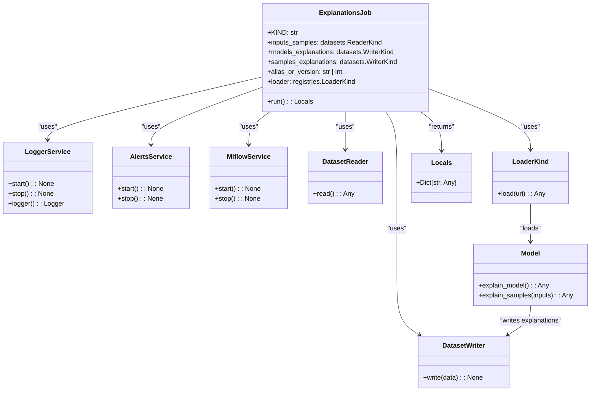

# US [Model Explanations Job](./backlog_mlops_regresion.md) : Define a job for explaining the model structure and decisions.

- [US Model Explanations Job : Define a job for explaining the model structure and decisions.](#us-model-explanations-job--define-a-job-for-explaining-the-model-structure-and-decisions)
  - [classes relations](#classes-relations)
  - [**User Stories: Explanation Job Management**](#user-stories-explanation-job-management)
    - [**1. User Story: Configure Explanations Job**](#1-user-story-configure-explanations-job)
    - [**2. User Story: Read Input Samples**](#2-user-story-read-input-samples)
    - [**3. User Story: Load the Model**](#3-user-story-load-the-model)
    - [**4. User Story: Generate Model Explanations**](#4-user-story-generate-model-explanations)
    - [**5. User Story: Generate Sample Explanations**](#5-user-story-generate-sample-explanations)
    - [**6. User Story: Write Explanations to Data Sources**](#6-user-story-write-explanations-to-data-sources)
    - [**7. User Story: Notify Completion of Explanations**](#7-user-story-notify-completion-of-explanations)
    - [**Common Acceptance Criteria**](#common-acceptance-criteria)
    - [**Definition of Done (DoD):**](#definition-of-done-dod)
  - [Code location](#code-location)
  - [Test location](#test-location)

------------

## classes relations

## **User Stories: Explanation Job Management**

---

### **1. User Story: Configure Explanations Job**

**Title:**  
As a **data scientist**, I want to configure an explanations job that includes all the necessary parameters, so that I can generate insights into the model's decisions.

**Description:**  
The `ExplanationsJob` class allows for setting up parameters such as input sample data readers, explanation writers, model references, and a loader for accessing the model from the registry.

**Acceptance Criteria:**  
- The explanations job is initialized with required parameters.
- Default values are correctly handled for optional parameters.

---

### **2. User Story: Read Input Samples**

**Title:**  
As a **data engineer**, I want to read input samples from specified sources, so that I can utilize them for generating explanations from the model.

**Description:**  
In the `run` method, input samples are read using the configured data reader, ensuring that the data is checked for validity against predefined schemas.

**Acceptance Criteria:**  
- The job successfully reads input samples from the designated reader.
- Input data is validated and checked for integrity before further processing.

---

### **3. User Story: Load the Model**

**Title:**  
As a **data scientist**, I want to load the registered model using a loader, so that I can generate explanations based on its structure and decisions.

**Description:**  
The job utilizes the specified loader to load the appropriate version or alias of the model from the model registry for evaluation.

**Acceptance Criteria:**  
- The model is correctly loaded from the registry using the configured loader.
- The model instance must be valid and ready for explanation generation.

---

### **4. User Story: Generate Model Explanations**

**Title:**  
As a **data scientist**, I want to generate explanations for the model's structure and decisions, so that I can understand how predictions are made.

**Description:**  
The job calls the model's explanation generation methods to retrieve insights about its architecture and decision-making processes.

**Acceptance Criteria:**  
- The model successfully generates structured explanations about its internal operations.
- The explanations are in a format that captures the necessary details for future analysis.

---

### **5. User Story: Generate Sample Explanations**

**Title:**  
As a **data scientist**, I want to generate explanations for specific input samples, so that I can interpret individual predictions made by the model.

**Description:**  
Sample explanations are generated based on the provided input samples, aiding in understanding how the model processes and predicts data.

**Acceptance Criteria:**  
- The job should effectively generate explanations for each input sample.
- Sample explanations should correlate appropriately with their respective input samples.

---

### **6. User Story: Write Explanations to Data Sources**

**Title:**  
As a **data engineer**, I want to write the generated model and sample explanations to specified data outputs, so that I can store and retrieve them for later analysis.

**Description:**  
The explanations generated for both the model and the input samples are saved to designated storage locations using the configured writers.

**Acceptance Criteria:**  
- Model explanations are successfully written to the specified outputs.
- Sample explanations are stored correctly, ensuring data persistence for future reference.

---

### **7. User Story: Notify Completion of Explanations**

**Title:**  
As a **user**, I want to be notified once the explanation job is completed, so that I can review the outcome and any generated insights.

**Description:**  
At the end of the job execution, notifications are sent to relevant stakeholders summarizing the particulars of the job completion.

**Acceptance Criteria:**  
- Notifications include details regarding the completed job and key metrics from the explanations.
- The alerts service is correctly utilized to inform users about job completion.

---

### **Common Acceptance Criteria**

1. **Implementation Requirements:**
   - The `ExplanationsJob` class overrides the `run` method defined in the base `Job` class.
   - All services (logging, model registry, alerts) are properly initialized.

2. **Error Handling:**
   - Any failures during reading, loading, or writing processes must be logged with clear error messages.

3. **Testing:**
   - Unit tests validate the job’s configuration, data processing, model loading, and explanation writing correctly.
   - Tests ensure proper error handling scenarios are also accounted for.

4. **Documentation:**
   - Comprehensive docstrings and examples are provided for clarity.
   - Users should have sufficient guidance on configuring and utilizing the explanations job.

---

### **Definition of Done (DoD):** 

- The `ExplanationsJob` class is fully implemented according to the outlined requirements.
- All functionalities are tested and verified against the acceptance criteria.
- Documentation is complete, making it easy for users to understand and use the job.

## Code location

[src/model_name/jobs/explanations.py](../src/model_name/jobs/explanations.py)

## Test location

[tests/jobs/test_explanations.py](../tests/jobs/test_explanations.py)
