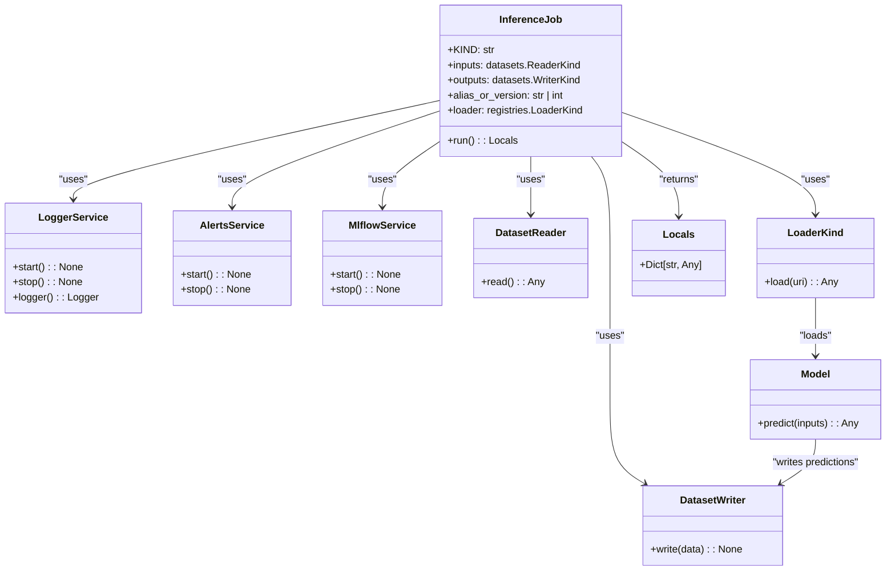

# US [Model Inference Job](./backlog_mlops_regresion.md) : Define a job for generating batch predictions from a registered model.

- [US Model Inference Job : Define a job for generating batch predictions from a registered model.](#us-model-inference-job--define-a-job-for-generating-batch-predictions-from-a-registered-model)
  - [classes relations](#classes-relations)
  - [**User Stories: Inference Job Management**](#user-stories-inference-job-management)
    - [**1. User Story: Configure Inference Job**](#1-user-story-configure-inference-job)
    - [**2. User Story: Read Input Data**](#2-user-story-read-input-data)
    - [**3. User Story: Load the Model**](#3-user-story-load-the-model)
    - [**4. User Story: Generate Predictions**](#4-user-story-generate-predictions)
    - [**5. User Story: Write Predictions to Data Output**](#5-user-story-write-predictions-to-data-output)
    - [**6. User Story: Notify Completion of Inference**](#6-user-story-notify-completion-of-inference)
    - [**Common Acceptance Criteria**](#common-acceptance-criteria)
    - [**Definition of Done (DoD):**](#definition-of-done-dod)
  - [Code location](#code-location)
  - [Test location](#test-location)

------------

## classes relations

## **User Stories: Inference Job Management**

---

### **1. User Story: Configure Inference Job**

**Title:**  
As a **data scientist**, I want to configure an inference job that specifies the necessary parameters for generating predictions, so that batch predictions can be effectively processed.

**Description:**  
The `InferenceJob` class enables the setup of the job with parameters such as input data readers, output data writers, model details, and the loader for accessing the model.

**Acceptance Criteria:**  
- The job is initialized with the necessary parameters.
- Default values are properly handled for optional fields.

---

### **2. User Story: Read Input Data**

**Title:**  
As a **data engineer**, I want to read input data from specified sources, so that the model can generate predictions based on these inputs.

**Description:**  
In the `run` method, the input data is read using the designated data reader, which ensures data integrity and prepares it for prediction.

**Acceptance Criteria:**  
- The job successfully reads input data using the configured reader.
- Input data is validated and conforms to the expected schema.

---

### **3. User Story: Load the Model**

**Title:**  
As a **data scientist**, I want to load the registered model from the model registry, so that I can use it to generate predictions on the input data.

**Description:**  
The job uses the configured loader to access the specified version or alias of the model from the registry.

**Acceptance Criteria:**  
- The model is loaded correctly from the registry using the provided loader.
- The model instance must be ready for making predictions.

---

### **4. User Story: Generate Predictions**

**Title:**  
As a **data scientist**, I want to generate predictions using the loaded model and the input data, so that I can evaluate the model's performance on new data points.

**Description:**  
The job leverages the model's predict method to produce output predictions based on the input data.

**Acceptance Criteria:**  
- Predictions are generated using the loaded model and validated input data.
- The output of the predictions is in a usable format for further processing.

---

### **5. User Story: Write Predictions to Data Output**

**Title:**  
As a **data engineer**, I want to write the generated predictions to a specified data output, so that results can be stored and retrieved later.

**Description:**  
The job takes the prediction outputs and writes them to the designated storage using the configured writer.

**Acceptance Criteria:**  
- The predictions are successfully written to the specified output using the writer.
- The method of storage should ensure data integrity.

---

### **6. User Story: Notify Completion of Inference**

**Title:**  
As a **user**, I want to be notified when the inference job is finished, along with the shape of the output data, so that I can review the results promptly.

**Description:**  
At the end of the job execution, notifications are sent to relevant stakeholders summarizing the outcome, including predictions shape.

**Acceptance Criteria:**  
- Notifications include job completion details, specifically the shape of the outputs.
- The alerts service successfully informs users about job completion status.

---

### **Common Acceptance Criteria**

1. **Implementation Requirements:**
   - The `InferenceJob` class correctly implements the abstract `run` method from the base `Job` class.
   - All necessary services (logging, model registry, alerts) are initialized at the start of the inference job.

2. **Error Handling:**
   - Clear error messages are logged for any issues encountered during the reading, loading, or writing processes.

3. **Testing:**
   - Unit tests validate job initialization, data reading, model loading, prediction generation, and output writing.
   - Tests ensure that errors in processes trigger appropriate logging and notifications.

4. **Documentation:**
   - Each class and method in the InferenceJob should have clear docstrings and examples provided for clarity.
   - Users should be guided on how to configure and use the inference job.

---

### **Definition of Done (DoD):** 

- The `InferenceJob` class is fully implemented and tests pass all acceptance criteria.
- The functionality includes reading inputs, loading models, generating predictions, writing outputs, and notifying users.
- The documentation is complete and well-structured for ease of understanding.

## Code location

[src/model_name/jobs/inference.py](../src/model_name/jobs/inference.py)

## Test location

[tests/jobs/test_inference.py](../tests/jobs/test_inference.py)
