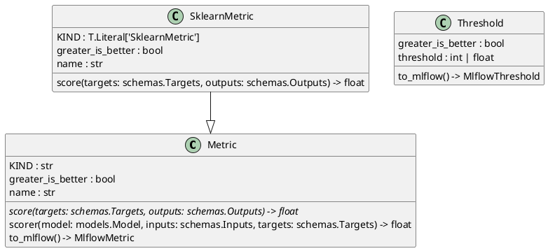

# US [Metrics](./backlog_mlops_regresion.md) : Provide standardized measurements for model performance, accuracy, and evaluation

Provide standardized measurements for model performance, accuracy, and evaluation. Useful for tracking improvement and identifying bottlenecks.

- [**DevOps Task: Implementing the `Metric` Base Class for Model Evaluation**](#devops-task-implementing-the-metric-base-class-for-model-evaluation)
- [**DevOps Task: Implementing the `SklearnMetric` Class for Scikit-Learn Metrics**](#devops-task-implementing-the-sklearnmetric-class-for-scikit-learn-metrics)
- [**DevOps Task: Implementing the `Threshold` Class for Metric Monitoring**](#devops-task-implementing-the-threshold-class-for-metric-monitoring)
- [Code location](#code-location)
- [Test location](#test-location)

------------

## **DevOps Task: Implementing the `Metric` Base Class for Model Evaluation**

**Objective:**  
Develop a reusable and extensible base class, `Metric`, that defines a blueprint for implementing metrics to evaluate machine learning model performance. This class will provide core functionality, ensure adherence to project standards, and integrate seamlessly with external tools like `mlflow`.

 **Task Description**

1. **Define Base Class Requirements**  
   - **Objective:** Establish the fundamental properties and methods that every metric implementation must include.  
   - **Actions:**  
     - Define the purpose of the `Metric` class as a way to evaluate model performance metrics such as accuracy, precision, recall, MAE, etc.  
     - Specify the attributes:  
       - `KIND`: A string representing the type of metric (abstract).  
       - `name`: The name of the metric for reporting purposes.  
       - `greater_is_better`: A boolean to indicate whether the metric is to be maximized or minimized.  

2. **Abstract Method: `score`**  
   - **Objective:** Create a method to compute the metric's value.  
   - **Actions:**  
     - Define `score` as an abstract method.  
     - Accept `targets` (expected values) and `outputs` (predicted values) as inputs.  
     - Ensure subclasses implement this method to calculate specific metrics.  

3. **Helper Method: `scorer`**  
   - **Objective:** Enable scoring of model predictions against targets using the metric.  
   - **Actions:**  
     - Accept a `model`, `inputs`, and `targets` as arguments.  
     - Use the model to generate predictions (`outputs`).  
     - Calculate the metric's score by passing the `targets` and `outputs` to the `score` method.  

4. **Integration with `mlflow`: `to_mlflow`**  
   - **Objective:** Provide compatibility with the `mlflow` platform for metric evaluation.  
   - **Actions:**  
     - Define a `to_mlflow` method that converts the metric to an `mlflow`-compatible metric.  
     - Create an inner `eval_fn` function to map predictions and targets to the metric computation.  
     - Adjust the metric value's sign based on the `greater_is_better` flag.  
     - Use `mlflow.metrics.make_metric` to register the metric with `mlflow`.  

5. **Leverage `pydantic` for Validation**  
   - **Objective:** Enforce strict validation of input data types and constraints.  
   - **Actions:**  
     - Use `pydantic.BaseModel` to inherit data validation capabilities.  
     - Set `strict=True`, `frozen=True`, and `extra="forbid"` to enforce immutability and strict attribute validation.  

6. **Test the Class**  
   - **Objective:** Validate the functionality and robustness of the `Metric` class.  
   - **Actions:**  
     - Write unit tests for all methods, ensuring proper handling of valid and invalid inputs.  
     - Test integration with the `mlflow` platform to ensure compatibility.  

7. **Documentation**  
   - **Objective:** Provide clear and detailed documentation for all attributes and methods.  
   - **Actions:**  
     - Add docstrings explaining the purpose, parameters, and return values for each method.  
     - Provide examples of usage where applicable.  

8. **Deployment**  
   - **Objective:** Ensure the class is ready for integration into the larger project.  
   - **Actions:**  
     - Verify compatibility with the existing codebase (`models` and `schemas` modules).  
     - Add the class to the project's deployment pipeline.  

**Deliverables:**  

- A well-documented `Metric` class, implemented as per the provided code template.  
- Unit and integration tests for the class.  
- Deployment-ready code integrated with `mlflow`.

------

## **DevOps Task: Implementing the `SklearnMetric` Class for Scikit-Learn Metrics**

**Objective:**  
Develop the `SklearnMetric` class, which extends the `Metric` base class to compute machine learning evaluation metrics using scikit-learn's built-in functions. This class will ensure efficient and standardized integration of scikit-learn metrics into the project workflow.

1. **Extend the `Metric` Base Class**  
   - **Objective:** Implement a specialized subclass of the `Metric` base class for metrics available in scikit-learn.  
   - **Actions:**  
     - Inherit from the `Metric` class to reuse its structure and functionality.  
     - Define the `KIND` attribute as `"SklearnMetric"` using `typing.Literal` for strict type enforcement.  

2. **Define Class Attributes**  
   - **Objective:** Specify default values and attributes required for scikit-learn metrics.  
   - **Actions:**  
     - Set `name` as `"mean_squared_error"` (default metric) to ensure compatibility with scikit-learn's metric functions.  
     - Define `greater_is_better` as `False` since `mean_squared_error` is minimized by default.  

3. **Implement the `score` Method**  
   - **Objective:** Compute the metric value using scikit-learn's metric functions.  
   - **Actions:**  
     - Override the `score` method inherited from `Metric`.  
     - Dynamically retrieve the scikit-learn metric function using `getattr(metrics, self.name)`.  
     - Extract `y_true` and `y_pred` from the `targets` and `outputs` schemas, respectively, ensuring compatibility with project-specific data structures.  
     - Apply the metric function to `y_pred` and `y_true`.  
     - Adjust the result's sign based on the `greater_is_better` flag.  
     - Return the computed metric value as a float.  

4. **Type Alias for Metric Variants**  
   - **Objective:** Define aliases for better type clarity and flexibility in handling multiple metric instances.  
   - **Actions:**  
     - Create a type alias, `MetricKind`, for the `SklearnMetric` class to differentiate it from other metric kinds.  
     - Define a `MetricsKind` type alias as a list of annotated `MetricKind` objects using `pydantic.Field` with the discriminator `KIND`.  

5. **Test Integration with Scikit-Learn**  
   - **Objective:** Validate the compatibility and functionality of the `SklearnMetric` class with scikit-learn metrics.  
   - **Actions:**  
     - Write unit tests for `score` to verify correct computation for different metrics like `accuracy_score`, `precision_score`, and `mean_squared_error`.  
     - Test edge cases, such as invalid metric names, mismatched `targets` and `outputs`, or incompatible data types.  

6. **Ensure Compatibility with Project Framework**  
   - **Objective:** Confirm the `SklearnMetric` class integrates seamlessly with other project components, such as schemas and `mlflow`.  
   - **Actions:**  
     - Test interaction with `schemas.Targets` and `schemas.Outputs`.  
     - Verify the `to_mlflow` functionality of the parent `Metric` class works as intended with the `SklearnMetric` subclass.  

7. **Documentation**  
   - **Objective:** Provide comprehensive documentation for the class and its usage.  
   - **Actions:**  
     - Add a class-level docstring describing its purpose and parameters (`name`, `greater_is_better`).  
     - Document the `score` method with examples of supported metrics.  

8. **Deployment**  
   - **Objective:** Prepare the class for production use.  
   - **Actions:**  
     - Add the `SklearnMetric` class to the appropriate module.  
     - Include the type aliases in the project’s type definitions.  
     - Ensure the class is deployed through the CI/CD pipeline after passing all tests.  

**Deliverables:**  

- A fully implemented and tested `SklearnMetric` class.  
- Comprehensive unit tests ensuring correctness and robustness.  
- Documentation explaining the class functionality and integration with scikit-learn.  
- Deployment-ready code integrated into the project.

----

## **DevOps Task: Implementing the `Threshold` Class for Metric Monitoring**

**Objective:**  

Develop the `Threshold` class, which provides a standardized mechanism to monitor model performance metrics against predefined thresholds. This class will support triggering alerts or actions when a threshold condition is met.

 **Task Description**

1. **Base Class Implementation**  
   - **Objective:** Define a robust and reusable base class for threshold logic in the project.  
   - **Actions:**  
     - Extend `abc.ABC` to enforce the abstract nature of the class, ensuring it serves as a foundation for future implementations.  
     - Use `pydantic.BaseModel` to leverage data validation and schema definitions.  
     - Set `strict=True` to enforce strict type validation for model attributes.  
     - Enable `frozen=True` to make instances immutable and safe for concurrent use.  
     - Define `extra="forbid"` to prevent unexpected fields from being added to the model.  

2. **Define Class Attributes**  
   - **Objective:** Provide essential properties to represent a metric threshold.  
   - **Actions:**  
     - Define `threshold` as a union of `int` and `float`, allowing flexibility in specifying numeric thresholds.  
     - Include `greater_is_better` as a boolean to specify if higher metric values are preferred.  

3. **Integrate with MLflow**  
   - **Objective:** Ensure compatibility with MLflow’s monitoring and evaluation framework.  
   - **Actions:**  
     - Implement the `to_mlflow` method to convert the `Threshold` instance into an `MlflowThreshold` object.  
     - Map the `threshold` and `greater_is_better` attributes directly to their MLflow equivalents.  

4. **Validation and Constraints**  
   - **Objective:** Enforce constraints to prevent invalid configurations.  
   - **Actions:**  
     - Validate that `threshold` is a positive number (if required by project specifications).  
     - Ensure `greater_is_better` aligns with the expected behavior for the associated metric.  

5. **Testing**  
   - **Objective:** Verify the correctness and reliability of the `Threshold` class.  
   - **Actions:**  
     - Write unit tests to validate `threshold` and `greater_is_better` behavior.  
     - Test the `to_mlflow` method to ensure proper integration with MLflow’s APIs.  
     - Include edge cases, such as extreme threshold values or conflicting parameter configurations.  

6. **Documentation**  
   - **Objective:** Provide clear and detailed documentation for the `Threshold` class.  
   - **Actions:**  
     - Add a class-level docstring explaining its purpose and usage scenarios.  
     - Document the `to_mlflow` method, including example use cases for MLflow integration.  

7. **Deployment**  
   - **Objective:** Make the class production-ready and integrate it into the project ecosystem.  
   - **Actions:**  
     - Place the `Threshold` class in the appropriate module for monitoring logic.  
     - Ensure proper inclusion in CI/CD pipelines with automated tests.  

 **Deliverables**  

- A fully implemented and tested `Threshold` class.  
- Unit tests for validation and integration with MLflow.  
- Documentation detailing usage and integration.  
- Deployment-ready code.

## Code location

[src/model_name/core/metrics.py](../src/model_name/core/metrics.py)

## Test location

[tests/core/test_metrics.py](../tests/core/test_metrics.py)
