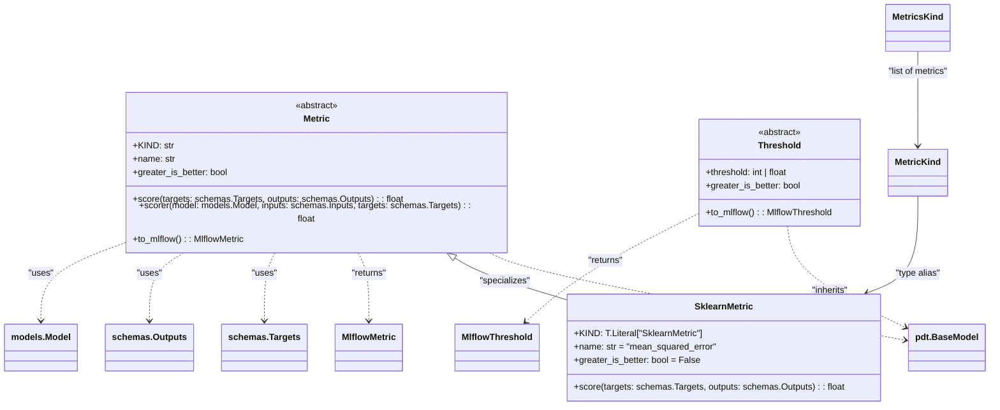

# US [Metrics](./backlog_mlops_regresion.md) : Provide standardized measurements for model performance, accuracy, and evaluation

Provide standardized measurements for model performance, accuracy, and evaluation. Useful for tracking improvement and identifying bottlenecks.

- [US Metrics : Provide standardized measurements for model performance, accuracy, and evaluation](#us-metrics--provide-standardized-measurements-for-model-performance-accuracy-and-evaluation)
  - [classes relations](#classes-relations)
  - [**User Story: Develop a Base Metric Class for Model Evaluation**](#user-story-develop-a-base-metric-class-for-model-evaluation)
  - [**User Story: Implement a Scikit-learn Metric Wrapper**](#user-story-implement-a-scikit-learn-metric-wrapper)
  - [**User Story: Implement a Threshold Class for Metric Monitoring**](#user-story-implement-a-threshold-class-for-metric-monitoring)
  - [Code location](#code-location)
  - [Test location](#test-location)

------------

## classes relations

## **User Story: Develop a Base Metric Class for Model Evaluation**

---

**Title:**  
As a **machine learning engineer**, I want a **base `Metric` class** to standardize the evaluation of model performance, so that I can consistently compute and report metrics across different models and use cases.

---

**Description:**  
The `Metric` class serves as a base for implementing various evaluation metrics, such as accuracy, precision, recall, F1, and MAE. It defines the core attributes and methods required for metric computation, ensures compatibility with external tools like `mlflow`, and facilitates seamless integration into machine learning pipelines.

---

**Acceptance Criteria:**  

1. **Attributes**  
   - Define `KIND` to identify the metric type.  
   - Include the following attributes:  
     - `name` (str): The name of the metric for reporting purposes.  
     - `greater_is_better` (bool): Indicates whether the metric should be maximized or minimized.  

2. **Abstract Method: `score`**  
   - Define `score` as an abstract method to compute the metric value.  
   - The method should:  
     - Accept `targets` (expected values) and `outputs` (predicted values) as inputs.  
     - Return a single float value representing the metric score.  

3. **Helper Method: `scorer`**  
   - Implement the `scorer` method to evaluate a model's predictions against targets using the metric.  
   - The method should:  
     - Accept a `model`, `inputs`, and `targets` as arguments.  
     - Use the model's `predict` method to generate predictions (`outputs`).  
     - Compute the metric score using the `score` method and return the result.  

4. **Integration with `mlflow`: `to_mlflow`**  
   - Provide a `to_mlflow` method to convert the metric into an `mlflow`-compatible metric object.  
   - The method should:  
     - Include an internal `eval_fn` function that maps model predictions and targets to the metric computation.  
     - Adjust the computed metric score based on the `greater_is_better` flag to ensure correct interpretation in `mlflow`.  
     - Use `mlflow.metrics.make_metric` to create the `mlflow` metric object.  

5. **Validation and Enforcement**  
   - Use `pydantic.BaseModel` to enforce strict data validation for the metric's attributes.  
   - Set `strict=True`, `frozen=True`, and `extra="forbid"` to ensure immutability and disallow undefined attributes.  

6. **Testing**  
   - Write unit tests for the following scenarios:  
     - Successful instantiation of metric subclasses with valid attributes.  
     - Enforcement of `score` implementation in subclasses.  
     - Accurate computation of metric scores using the `score` and `scorer` methods.  
     - Successful conversion of metrics to `mlflow`-compatible objects using `to_mlflow`.  
   - Ensure the tests cover edge cases, such as invalid inputs or incompatible attribute values.  

7. **Documentation**  
   - Provide clear and comprehensive docstrings for all attributes and methods.  
   - Include usage examples, demonstrating how to:  
     - Define a custom metric by subclassing `Metric`.  
     - Compute a metric score using `scorer`.  
     - Convert a metric to an `mlflow` metric object.  

---

**Definition of Done (DoD):**  

- The `Metric` class is implemented with all specified attributes and methods.  
- Abstract methods enforce implementation in derived classes.  
- The class integrates seamlessly with `mlflow`.  
- Unit tests validate the functionality and robustness of the class.  
- Documentation is complete, with examples and clear explanations.  
- The code passes all CI/CD validation checks and is ready for deployment.

## **User Story: Implement a Scikit-learn Metric Wrapper**

---

**Title:**  
As a **data scientist**, I want to use `SklearnMetric` to compute evaluation metrics using scikit-learn functions, so that I can easily integrate standardized metrics into my machine learning workflows.

---

**Description:**  
The `SklearnMetric` class extends the `Metric` base class to utilize scikit-learn's extensive library of evaluation metrics. This class enables the computation of metrics such as Mean Squared Error (MSE), Mean Absolute Error (MAE), and others with minimal configuration, ensuring flexibility and compatibility with existing tools and pipelines.

---

**Acceptance Criteria:**  

1. **Attributes**  
   - **KIND**:  
     - Set to `"SklearnMetric"` to identify this metric type.  
   - **name**:  
     - Default to `"mean_squared_error"`.  
     - Represents the name of the scikit-learn metric function to be used.  
   - **greater_is_better**:  
     - Default to `False`.  
     - Indicates whether the metric should be maximized or minimized during evaluation.  

2. **`score` Method**  
   - Computes the metric value using the specified scikit-learn metric function.  
   - Functionality:  
     - Retrieve the appropriate metric function using `getattr(metrics, name)`.  
     - Extract `y_true` and `y_pred` from the provided `targets` and `outputs`.  
     - Adjust the metric value's sign based on the `greater_is_better` attribute.  
     - Return the computed score as a float.  

3. **Integration with `Metric`**  
   - Ensure compatibility with the `Metric` base class by:  
     - Implementing the `score` method.  
     - Using attributes and functionality inherited from `Metric`.  

4. **Testing**  
   - Validate the following scenarios:  
     - Computation of supported scikit-learn metrics (e.g., MSE, MAE, accuracy).  
     - Proper adjustment of the score sign when `greater_is_better` is `True` or `False`.  
     - Handling of invalid or unsupported metric names with appropriate error messages.  
   - Include edge cases for mismatched input sizes or data types.  

5. **Documentation**  
   - Provide clear docstrings for:  
     - The `SklearnMetric` class, explaining its purpose and usage.  
     - Each parameter, including examples of valid scikit-learn metric names.  
     - The `score` method, detailing how it calculates the metric value.  
   - Add usage examples demonstrating:  
     - Instantiation of a `SklearnMetric` object.  
     - Computation of a metric using `score`.  

6. **Compatibility**  
   - Ensure the class works seamlessly with the `Metric` base class and supports serialization through `pydantic`.  
   - Validate that it integrates with external tools, such as `mlflow`, via the `Metric` interface.

---

**Definition of Done (DoD):**  

- The `SklearnMetric` class is implemented and passes all specified test cases.  
- Clear and comprehensive documentation is provided, including usage examples.  
- The class integrates with the `Metric` base class and other tools like `mlflow`.  
- The code passes CI/CD validation and is ready for deployment in the machine learning project.

## **User Story: Implement a Threshold Class for Metric Monitoring**

---

**Title:**  
As a **machine learning engineer**, I want to define a `Threshold` class for metrics, so that I can monitor model performance and trigger alerts when thresholds are met.

---

**Description:**  
The `Threshold` class provides a way to define and manage thresholds for metrics used in machine learning models. By setting specific threshold values, this class helps ensure model performance stays within acceptable limits and enables automatic triggering of alerts or actions when thresholds are breached. The class also supports seamless integration with tools like `mlflow`.

---

**Acceptance Criteria:**  

1. **Attributes**  
   - **`threshold`**:  
     - Represents the absolute threshold value as an `int` or `float`.  
   - **`greater_is_better`**:  
     - A boolean indicating whether exceeding the threshold (`True`) or staying below it (`False`) is considered better performance.  

2. **Method: `to_mlflow`**  
   - Converts the `Threshold` instance into an `MlflowThreshold` object for use in monitoring and alerting within the `mlflow` framework.  
   - Functionality:  
     - Returns an `MlflowThreshold` object initialized with the `threshold` and `greater_is_better` attributes.  

3. **Validation**  
   - Use `pydantic` to enforce strict validation of input types and constraints:  
     - `threshold` must be an `int` or `float`.  
     - `greater_is_better` must be a `bool`.  
     - Enforce immutability with `frozen=True`.  
   - Ensure the class is marked as `strict=True` and forbids extra fields with `extra="forbid"`.  

4. **Integration**  
   - The class should be compatible with metric-related functionality in the project, allowing thresholds to be defined and monitored alongside metrics.  
   - Seamless integration with `mlflow` for defining thresholds in monitoring workflows.  

5. **Testing**  
   - Validate the following scenarios:  
     - Correct initialization of the `Threshold` object with valid inputs.  
     - Conversion of a `Threshold` instance to an `MlflowThreshold` object.  
     - Handling of invalid data types or missing attributes with appropriate error messages.  
   - Include edge cases, such as:  
     - Extremely high or low threshold values.  
     - Opposite configurations of `greater_is_better` (e.g., maximizing vs. minimizing).  

6. **Documentation**  
   - Provide detailed docstrings for:  
     - The `Threshold` class, including its purpose and parameters.  
     - The `to_mlflow` method, explaining its functionality and return value.  
   - Add usage examples demonstrating:  
     - Initialization of a `Threshold` object.  
     - Conversion to an `MlflowThreshold`.  

7. **Extensibility**  
   - Ensure the class can be extended in the future to support additional threshold-related functionality, such as dynamic threshold adjustment or multi-metric thresholds.  

---

**Definition of Done (DoD):**  

- The `Threshold` class is implemented and passes all specified test cases.  
- The class integrates with `mlflow` via the `to_mlflow` method.  
- Clear documentation and usage examples are provided.  
- The implementation is validated in the project's CI/CD pipeline and is deployment-ready.

## Code location

[src/model_name/core/models.py](../src/model_name/core/metrics.py)

## Test location

[tests/core/test_models.py](../tests/core/test_metrics.py)