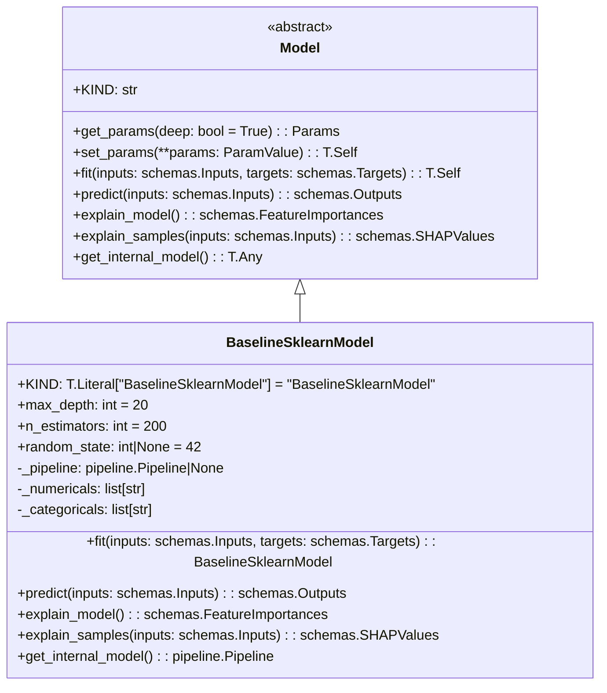

# US [Models](./backlog_mlops_regresion.md) : Define the structure of machine learning models, including architectures and checkpoints, to standardize training and deployment

- [US Models : Define the structure of machine learning models, including architectures and checkpoints, to standardize training and deployment](#us-models--define-the-structure-of-machine-learning-models-including-architectures-and-checkpoints-to-standardize-training-and-deployment)
  - [classes relations](#classes-relations)
  - [**User Story: Develop a Base Model Class for Machine Learning Frameworks**](#user-story-develop-a-base-model-class-for-machine-learning-frameworks)
  - [**User Story: Develop a Baseline Scikit-Learn Model for Machine Learning**](#user-story-develop-a-baseline-scikit-learn-model-for-machine-learning)
  - [Code location](#code-location)
  - [Test location](#test-location)

------------

## classes relations

## **User Story: Develop a Base Model Class for Machine Learning Frameworks**

---

**Title:**  
As a **machine learning engineer**, I want a **base `Model` class** to standardize the implementation of machine learning models, so that I can easily integrate different frameworks and ensure a consistent interface across the project.

---

**Description:**  
The `Model` class serves as an abstract base class for all machine learning models in the project. It defines a set of essential methods and attributes required for training, predicting, and explaining models. By implementing this base class, users can create custom models that adhere to the project's standards and integrate seamlessly into the pipeline.

---

**Acceptance Criteria:**  

1. **Attributes**  
   - Define the `KIND` attribute to identify the type of model being implemented.  
   - Ensure `KIND` is unique for each subclass of the `Model` class.  

2. **Parameter Management**  
   - **Get Parameters:**  
     - Implement the `get_params` method to retrieve all model parameters.  
     - Exclude private (`_`) and uppercase attributes from the parameters list.  
   - **Set Parameters:**  
     - Implement the `set_params` method to update the model's parameters dynamically.  
     - Ensure that parameter updates are applied in place and return the updated model instance.  

3. **Core Methods**  
   - Define the following abstract methods:  
     - `fit(inputs: schemas.Inputs, targets: schemas.Targets)`  
       - Train the model on provided inputs and targets.  
       - Return the fitted model instance.  
     - `predict(inputs: schemas.Inputs)`  
       - Generate predictions using the trained model.  
       - Return outputs in the `schemas.Outputs` format.  

4. **Model Explainability**  
   - **Global Explainability:**  
     - Provide an `explain_model` method to return feature importances.  
     - Raise a `NotImplementedError` if not overridden by the subclass.  
   - **Local Explainability:**  
     - Provide an `explain_samples` method to return SHAP values for individual samples.  
     - Raise a `NotImplementedError` if not overridden by the subclass.  

5. **Internal Model Access**  
   - Implement the `get_internal_model` method to expose the internal model object (e.g., a scikit-learn or TensorFlow model).  
   - Raise a `NotImplementedError` if the method is not overridden by the subclass.  

6. **Validation and Enforcement**  
   - Use `pydantic.BaseModel` to enforce strict validation of model attributes and parameters.  
   - Set `strict=True`, `frozen=False`, and `extra="forbid"` to ensure data consistency while allowing parameter updates.  

7. **Testing**  
   - Validate the following scenarios:  
     - Successful instantiation of model subclasses.  
     - Proper parameter retrieval and updates using `get_params` and `set_params`.  
     - Enforcement of abstract method implementation in subclasses.  
   - Write unit tests for all methods, ensuring they behave as expected.

---

**Definition of Done (DoD):**  
- The `Model` class is implemented with all specified methods and attributes.  
- Abstract methods enforce implementation in derived classes.  
- Subclass compatibility is verified with unit tests.  
- The class is well-documented, including detailed examples of usage.  
- The code passes all CI/CD validation checks and integrates seamlessly with existing project modules.
  

## **User Story: Develop a Baseline Scikit-Learn Model for Machine Learning**

---

**Title:**  
As a **data scientist**, I want a reusable **baseline model implementation using scikit-learn**, so that I can easily benchmark advanced models and understand the predictive performance of standard machine learning techniques.

---

**Description:**  
The `BaselineSklearnModel` class provides a baseline regression model leveraging scikit-learn's `RandomForestRegressor` wrapped in a preprocessing pipeline. This class is designed to be easily integrated into the project, with capabilities for training, predicting, and model explainability. It supports automated handling of numerical and categorical features and provides SHAP-based feature importance explanations.

---

**Acceptance Criteria:**  

1. **Model Parameters**  
   - Define the following configurable parameters for the model:  
     - `max_depth` (default: 20): Controls the depth of the random forest trees.  
     - `n_estimators` (default: 200): Specifies the number of trees in the forest.  
     - `random_state` (default: 42): Ensures reproducibility of the results.  

2. **Feature Handling**  
   - **Numerical Features:**  
     - Include attributes such as `temp`, `atemp`, `hum`, `windspeed`, and other specified columns.  
   - **Categorical Features:**  
     - Use one-hot encoding for features like `season` and `weathersit`.  
   - Exclude highly correlated features like `registered` to avoid data leakage.

3. **Pipeline Construction**  
   - Combine preprocessing steps for numerical and categorical data using a `ColumnTransformer`.  
   - Integrate the transformer with a `RandomForestRegressor` in a single scikit-learn `Pipeline`.

4. **Model Training**  
   - Implement the `fit` method to train the pipeline using input features and target values.  
   - Ensure the model is correctly saved for future predictions.

5. **Prediction**  
   - Implement the `predict` method to generate predictions using the fitted pipeline.  
   - Output predictions in the defined `schemas.Outputs` format.

6. **Model Explainability**  
   - **Global Explainability:**  
     - Provide feature importance scores using the `explain_model` method.  
     - Map feature importance to transformed feature names for clear interpretation.  
   - **Local Explainability:**  
     - Implement the `explain_samples` method to provide SHAP values for specific input samples.  
     - Ensure SHAP values align with the transformed features.

7. **Error Handling**  
   - Raise appropriate errors when attempting to use the model before training (`ValueError`).  

8. **Validation and Testing**  
   - Validate the following scenarios:  
     - Training the model with valid inputs and targets.  
     - Generating predictions from trained models.  
     - Explaining model structure and predictions.  
   - Write unit tests to ensure correct implementation of each method.  

---

**Definition of Done (DoD):**  
- All methods (`fit`, `predict`, `explain_model`, `explain_samples`, `get_internal_model`) are implemented and tested.  
- Documentation provides clear examples for model usage, training, prediction, and explanation.  
- Code is integrated into the project and passes all CI/CD checks.  
- SHAP-based explanations are verified for consistency with transformed features.  
- Model outputs conform to `schemas.Outputs` and are reproducible with a fixed `random_state`.

## Code location

[src/model_name/core/models.py](../src/model_name/core/models.py)

## Test location

[tests/core/test_models.py](../tests/core/test_models.py)