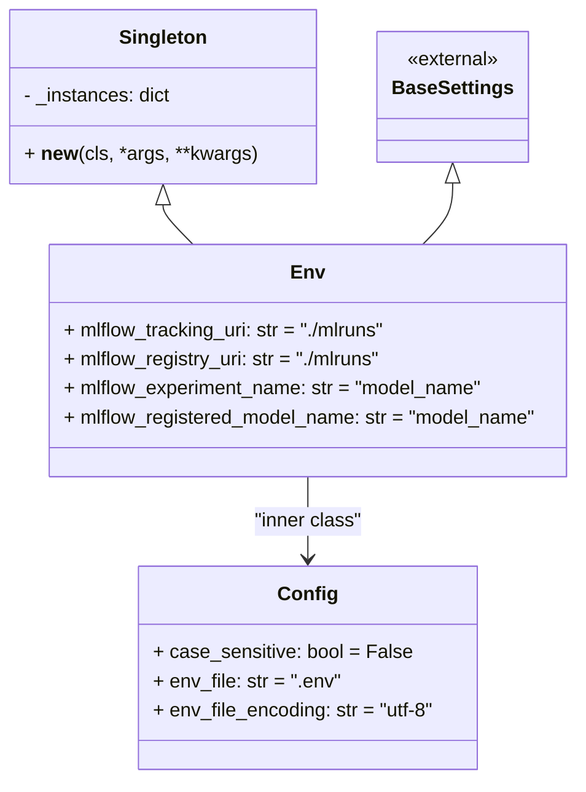

# US [IO](./backlog_mlops_regresion.md) :  Provide environment variables and system-level configurations for portability across various environments.

- [US IO :  Provide environment variables and system-level configurations for portability across various environments.](#us-io---provide-environment-variables-and-system-level-configurations-for-portability-across-various-environments)
  - [classes relations](#classes-relations)
  - [**User Story: Environment Configuration Management with Singleton and Pydantic**](#user-story-environment-configuration-management-with-singleton-and-pydantic)
    - [**1. User Story: Centralized Environment Configuration**](#1-user-story-centralized-environment-configuration)
    - [**2. User Story: Ensure Consistent MLflow Configuration**](#2-user-story-ensure-consistent-mlflow-configuration)
  - [**Common Acceptance Criteria**](#common-acceptance-criteria)
  - [**Example Use Cases**](#example-use-cases)
  - [**Definition of Done (DoD):**](#definition-of-done-dod)
  - [Code location](#code-location)
  - [Test location](#test-location)

------------

## classes relations




## **User Story: Environment Configuration Management with Singleton and Pydantic**

---

### **1. User Story: Centralized Environment Configuration**

**Title:**  
As a **developer**, I want a centralized and reusable way to manage environment variables and configuration settings so that I can ensure consistent behavior across the application.

**Description:**  
The `Env` class combines the Singleton pattern and Pydantic's `BaseSettings` to create a single shared instance for managing environment-specific configurations. It ensures that environment variables are accessible, validated, and loaded from a `.env` file if available.

**Acceptance Criteria:**  
- The `Env` class:
  - Inherits from both `Singleton` and Pydantic's `BaseSettings`.
  - Ensures only one instance of the class exists throughout the application (Singleton behavior).
  - Provides default values for MLflow-related environment variables.
  - Supports loading configurations from a `.env` file.
- Environment variables are:
  - Case-insensitive (optional feature).
  - Readable from both the system environment and a `.env` file.
  - Validated using Pydantic's type system.
- The `Config` class:
  - Enables `.env` file reading with UTF-8 encoding.
  - Handles case-insensitive environment variable lookups if enabled.

---

### **2. User Story: Ensure Consistent MLflow Configuration**

**Title:**  
As a **machine learning engineer**, I want to configure MLflow settings (tracking URI, registry URI, experiment name, etc.) in a single place so that I can easily manage and update them without code duplication.

**Description:**  
The `Env` class provides default and customizable values for MLflow-related configurations. It ensures that all MLflow components use the same settings consistently, reducing potential misconfigurations.

**Acceptance Criteria:**  
- The following MLflow configuration keys are available:
  - `mlflow_tracking_uri`: Default is `"./mlruns"`.
  - `mlflow_registry_uri`: Default is `"./mlruns"`.
  - `mlflow_experiment_name`: Default is `"model_name"`.
  - `mlflow_registered_model_name`: Default is `"model_name"`.
- Values can be overridden by environment variables or a `.env` file.
- The Singleton pattern ensures no accidental re-creation of the `Env` instance.

---

## **Common Acceptance Criteria**

1. **Implementation Requirements:**
   - The `Singleton` pattern ensures a single shared instance of the `Env` class.
   - Default values are provided for MLflow configuration keys.

2. **Environment Variable Management:**
   - Values are first read from the environment variables.
   - If not set, values are read from the `.env` file.
   - Defaults are used if neither source provides a value.

3. **Error Handling:**
   - The `Env` class validates all settings using Pydantic's type system.
   - Errors are raised if a setting does not meet its type requirements.

4. **Testing:**
   - Unit tests verify:
     - Singleton behavior of the `Env` class.
     - Correct loading of environment variables and `.env` file values.
     - Validation of MLflow-related settings.
   - Mocking is used to simulate environment variables and `.env` file contents.

5. **Documentation:**
   - Class-level docstrings explain the purpose and usage of `Env` and `Singleton`.
   - Examples demonstrate:
     - Accessing MLflow settings via the `Env` class.
     - Overriding values with environment variables or a `.env` file.

---

## **Example Use Cases**

1. **Accessing MLflow Settings:**
   ```python
   env = Env()
   print(env.mlflow_tracking_uri)  # Output: "./mlruns" (default or overridden)
   ```

2. **Using the Singleton Pattern:**
   ```python
   env1 = Env()
   env2 = Env()
   assert env1 is env2  # True, as both point to the same instance.
   ```

3. **Overriding via Environment Variables or `.env`:**
   - Set `MLFLOW_TRACKING_URI="http://localhost:5000"` in `.env` file or environment.
   - Access with:
     ```python
     env = Env()
     print(env.mlflow_tracking_uri)  # Output: "http://localhost:5000"
     ```

---

## **Definition of Done (DoD):**

- The `Env` class implements environment configuration management with validation.
- The Singleton behavior is verified, ensuring a single instance is used.
- The `.env` file and environment variables are correctly loaded and take precedence over defaults.
- All functionality is tested, with error scenarios validated.
- Documentation provides clear usage instructions and examples.
- 
## Code location

[src/model_name/core/schemas.py](../src/model_name/io/osvariables.py)

## Test location

[tests/core/test_schemas.py](../tests/io/osvariables.py)