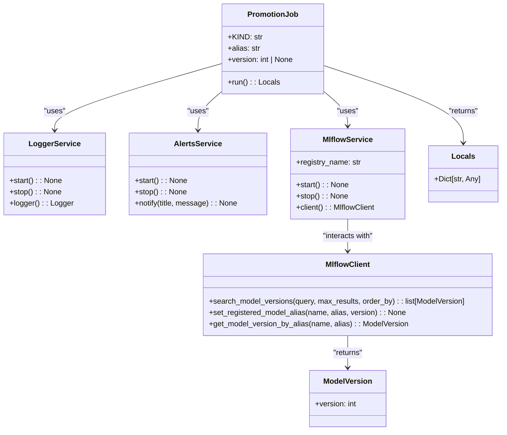

# US [Model Promotion Job](./backlog_mlops_regresion.md) : Define a job for promoting a registered model version with an alias.

- [US Model Promotion Job : Define a job for promoting a registered model version with an alias.](#us-model-promotion-job--define-a-job-for-promoting-a-registered-model-version-with-an-alias)
  - [classes relations](#classes-relations)
  - [**User Stories: Promotion Job Management**](#user-stories-promotion-job-management)
    - [**1. User Story: Configure Promotion Job**](#1-user-story-configure-promotion-job)
    - [**2. User Story: Determine Model Version to Promote**](#2-user-story-determine-model-version-to-promote)
    - [**3. User Story: Promote Model Version**](#3-user-story-promote-model-version)
    - [**4. User Story: Notify Completion of Promotion**](#4-user-story-notify-completion-of-promotion)
    - [**Common Acceptance Criteria**](#common-acceptance-criteria)
    - [**Definition of Done (DoD):**](#definition-of-done-dod)
  - [Code location](#code-location)
  - [Test location](#test-location)

------------

## classes relations

## **User Stories: Promotion Job Management**

---

### **1. User Story: Configure Promotion Job**

**Title:**  
As a **model manager**, I want to configure a promotion job with the required alias and version parameters, so that I can promote a specific model version in the registry.

**Description:**  
The `PromotionJob` class allows for the setup of the job by specifying the alias to be used for the promoted model and the model version to be promoted.

**Acceptance Criteria:**  
- The promotion job is initialized with the specified alias and model version.
- Default values are correctly set, allowing for flexibility in promotion decisions.

---

### **2. User Story: Determine Model Version to Promote**

**Title:**  
As a **data engineer**, I want the job to determine which version of the model to promote based on the configuration, so that I can manage model versions effectively.

**Description:**  
In the `run` method, the promotion job should check if a specific model version is provided; if not, it should default to the latest version in the model registry.

**Acceptance Criteria:**  
- If a version is not specified, the job retrieves the latest model version based on the model name.
- The selected version is logged for clarity.

---

### **3. User Story: Promote Model Version**

**Title:**  
As a **model manager**, I want to promote the specified model version under the defined alias within the model registry, so that I can transition model versions as necessary in my deployment pipeline.

**Description:**  
The job should use the MLflow client to set the specified alias to the chosen model version, making it easy to reference the promoted model in future operations.

**Acceptance Criteria:**  
- The job correctly promotes the model version and sets the alias through the MLflow client.
- Confirmation of the promotion action is logged with details of the model and version.

---

### **4. User Story: Notify Completion of Promotion**

**Title:**  
As a **user**, I want to receive a notification upon completion of the promotion job, so that I can confirm the transition was successful.

**Description:**  
At the conclusion of the job execution, the promotion job sends notifications to inform stakeholders of the results.

**Acceptance Criteria:**  
- Notifications include details about the promoted version and alias.
- The alerts service successfully informs users of the job completion.

---

### **Common Acceptance Criteria**

1. **Implementation Requirements:**
   - The `PromotionJob` class correctly implements the abstract `run` method from the base `Job` class.
   - All necessary services (logging, MLflow, alerts) are initialized appropriately.

2. **Error Handling:**
   - Any issues encountered during the promotion process should be logged with clear error messages and handled gracefully.

3. **Testing:**
   - Unit tests validate job initialization, model version retrieval, promotion actions, and notification delivery.
   - Tests ensure accurate exception handling scenarios are adequately assessed.

4. **Documentation:**
   - Comprehensive docstrings explain the purpose of each class and method.
   - Users are provided with examples and guidance on how to configure and utilize the promotion job.

---

### **Definition of Done (DoD):** 

- The `PromotionJob` class is fully implemented and functional.
- All functionalities are tested and confirmed to meet the acceptance criteria.
- The documentation is clear, complete, and accessible for user understanding.

## Code location

[src/model_name/jobs/promotion.py](../src/model_name/jobs/promotion.py)

## Test location

[tests/jobs/test_promotion.py](../tests/jobs/test_promotion.py)
