# US [Model Registry Management](./backlog_mlops_regresion.md) : Efficiently manage the saving, loading, and registration of machine learning models.

- [US Model Registry Management : Efficiently manage the saving, loading, and registration of machine learning models.](#us-model-registry-management--efficiently-manage-the-saving-loading-and-registration-of-machine-learning-models)
  - [Classes Relations](#classes-relations)
  - [**User Stories: Model Saver Implementation**](#user-stories-model-saver-implementation)
    - [**1. User Story: Save a Model**](#1-user-story-save-a-model)
    - [**2. User Story: Save a Custom Model**](#2-user-story-save-a-custom-model)
    - [**Common Acceptance Criteria**](#common-acceptance-criteria)
    - [**Definition of Done (DoD):**](#definition-of-done-dod)
  - [**User Stories: Model Loader Implementation**](#user-stories-model-loader-implementation)
    - [**1. User Story: Load a Model from Registry**](#1-user-story-load-a-model-from-registry)
    - [**2. User Story: Load a Custom Model**](#2-user-story-load-a-custom-model)
    - [**Common Acceptance Criteria**](#common-acceptance-criteria-1)
    - [**Definition of Done (DoD):**](#definition-of-done-dod-1)
  - [**User Stories: Model Registration Implementation**](#user-stories-model-registration-implementation)
    - [**1. User Story: Register a Model**](#1-user-story-register-a-model)
    - [**Common Acceptance Criteria**](#common-acceptance-criteria-2)
    - [**Definition of Done (DoD):**](#definition-of-done-dod-2)
  - [Code location](#code-location)
  - [Test location](#test-location)

------------

## Classes Relations

```mermaid
classDiagram
    %% Base Class: Saver
    class Saver {
        <<abstract>>
        +KIND: str
        +path: str
        +save(model: [REDACTED]del, signature: [REDACTED]gnature, input_example: [REDACTED]puts): Info
    }

    %% CustomSaver Class
    class CustomSaver {
        +KIND: [REDACTED]teral["CustomSaver"]
        +save(model: [REDACTED]del, signature: [REDACTED]gnature, input_example: [REDACTED]puts): Info
    }
    Saver <|-- CustomSaver : "specializes"

    %% BuiltinSaver Class
    class BuiltinSaver {
        +KIND: [REDACTED]teral["BuiltinSaver"]
        +save(model: [REDACTED]del, signature: [REDACTED]gnature, input_example: [REDACTED]puts): [REDACTED]del_[REDACTED]delVersion
    }
    Saver <|-- BuiltinSaver : "specializes"

    %% Base Class: Loader
    class Loader {
        <<abstract>>
        +KIND: str
        +load(uri: str): "[REDACTED]apter"
    }

    %% CustomLoader Class
    class CustomLoader {
        +KIND: [REDACTED]teral["CustomLoader"]
        +load(uri: str): "[REDACTED]apter"
    }
    Loader <|-- CustomLoader : "specializes"

    %% BuiltinLoader Class
    class BuiltinLoader {
        +KIND: [REDACTED]teral["BuiltinLoader"]
        +load(uri: str): "[REDACTED]apter"
    }
    Loader <|-- BuiltinLoader : "specializes"

    %% Base Class: Register
    class Register {
        <<abstract>>
        +KIND: str
        +register(name: str, model_uri: str): Version
    }

    %% MlflowRegister Class
    class MlflowRegister {
        +KIND: [REDACTED]teral["MlflowRegister"]
        +register(name: str, model_uri: str): Version
    }
    Register <|-- MlflowRegister : "specializes"

```

## **User Stories: Model Saver Implementation**

---

### **1. User Story: Save a Model**

**Title:**  
As a **data engineer**, I want to save machine learning models to a model registry so that I can manage and version my models effectively.

**Description:**  
The `Saver` class provides the interface for saving models with different serialization methods. Concrete implementations, such as `CustomSaver` and `BuiltinSaver`, allow for flexibility in saving models based on the project's needs.

**Acceptance Criteria:**  
- The `Saver` class is abstract and requires subclasses to implement the `save` method.
- Models can be saved with required metadata including signature and input examples.
- Appropriate errors are raised if saving fails due to incompatibility issues.

---

### **2. User Story: Save a Custom Model**

**Title:**  
As a **data scientist**, I want to save a project-specific model using a custom saver implementation so that I can utilize specialized serialization methods.

**Description:**  
The `CustomSaver` can adjust the model to conform to the Mlflow PyFunc flavor for logging. This ensures that the model is saved correctly while adhering to specific project needs.

**Acceptance Criteria:**  
- The `CustomSaver` implementation successfully saves the model using custom methods.
- Input examples and signature are validated and logged correctly.
- The adapter correctly wraps the custom model logic.

---

### **Common Acceptance Criteria**

1. **Implementation Requirements:**
   - All savers must inherit from the `Saver` class and implement the `save` method.
   - Each saver must handle input validation and raise errors appropriately.

2. **Error Handling:**
   - If the model is incompatible, an informative error is returned during the save operation.
   - Proper validation of input examples is conducted before processing.

3. **Testing:**
   - Unit tests validate that both the `CustomSaver` and `BuiltinSaver` save models correctly and handle errors.
   - Mock data and signature examples should be used for testing.

4. **Documentation:**
   - Clear docstrings specify the functionality of the savers and expected inputs and outputs.

---

### **Definition of Done (DoD):**

- The `Saver`, `CustomSaver`, and `BuiltinSaver` classes are implemented with clear documentation.
- All saving functionalities are tested.
- Unit tests validate each functionality and fail gracefully when encountering errors.
- Documentation includes usage examples for developers.
  
## **User Stories: Model Loader Implementation**

---

### **1. User Story: Load a Model from Registry**

**Title:**  
As a **data engineer**, I want to load saved models from the model registry so that I can quickly retrieve and use them for inference.

**Description:**  
The `Loader` class defines the interface for loading models from various backends. Implementations such as `CustomLoader` enable easy retrieval of models without modifying existing codebases.

**Acceptance Criteria:**  
- The `Loader` class must have an abstract `load` method which must be implemented by subclasses.
- Models can be loaded using a specified URI that refers to the location in the model registry.
- The correct adapter is returned for the loaded model.

---

### **2. User Story: Load a Custom Model**

**Title:**  
As a **data scientist**, I want to load a project-specific model using a loader implementation so that I can use adapted logic for inference.

**Description:**  
The `CustomLoader` provides functionality to retrieve custom models and wrap them for usage in the project, maintaining adherence to specific input/output formats.

**Acceptance Criteria:**  
- The `CustomLoader` successfully retrieves the model and presents it in a usable format.
- Structured input data adheres to schemas defined in the project.
- Errors are raised gracefully if loading fails.

---

### **Common Acceptance Criteria**

1. **Implementation Requirements:**
   - The `Loader`, `CustomLoader`, and `BuiltinLoader` classes must adhere to the same interfaces and raise errors appropriately.

2. **Error Handling:**
   - Any loading process must validate URIs and ensure models are accessible.
   - Documented and informative errors are raised on failures.

3. **Testing:**
   - Extensive tests must ensure that all loader implementations function correctly.
   - Mock model URIs in tests should simulate real-world registry interactions.

4. **Documentation:**
   - All loaders should have thorough documentation for developers detailing usage and expected behavior.

---

### **Definition of Done (DoD):**

- The `Loader`, `CustomLoader`, and `BuiltinLoader` classes are implemented with clear documentation.
- All loading functionalities are tested.
- Unit tests validate model loading and error scenarios.
- Detailed documentation includes usage examples for loading models from the registry.

  
## **User Stories: Model Registration Implementation**

---

### **1. User Story: Register a Model**

**Title:**  
As a **data engineer**, I want to register models in the model registry so that I can keep track of my models' versions and metadata.

**Description:**  
The `Register` base class defines the fundamental aspects of model registration, while `MlflowRegister` implements the functionality necessary to log models with defined tags and metadata.

**Acceptance Criteria:**  
- A model can be registered using its name and URI, returning the version information.
- The model URI must correspond to existing saved models in the registry.
- Tags for models can be defined and associated during the registration process.

---

### **Common Acceptance Criteria**

1. **Implementation Requirements:**
   - The `Register` and `MlflowRegister` classes both implement the necessary register method.

2. **Error Handling:**
   - Registration must fail gracefully if the model URI is invalid or inaccessible.
   - The process must have checks for proper tags formatting before registration.

3. **Testing:**
   - Unit tests must validate the registration process against mock model URIs.
   - Tests must cover scenarios where registration could fail.

4. **Documentation:**
   - Adequate documentation provides insights into the usage of the registration system.

---

### **Definition of Done (DoD):**

- The `Register` and `MlflowRegister` classes are implemented and documented.
- All registration functionalities are tested, ensuring successful tracking of model versions.
- Unit tests verify registration, including error scenarios.
- Documentation includes detailed instructions for registering models with examples.

## Code location

[src/model_name/core/model_registries.py](../src/model_name/io/registries.py)

## Test location

[tests/core/test_model_registries.py](../tests/io/test_registries.py)
