# US [Model Registry](./backlog_mlops_regresion.md) : Manage saving, loading, and registering machine learning models using MLflow.

- [US Model Registry : Manage saving, loading, and registering machine learning models using MLflow.](#us-model-registry--manage-saving-loading-and-registering-machine-learning-models-using-mlflow)
  - [classes relations](#classes-relations)
  - [**User Stories: Model Saver and Loader**](#user-stories-model-saver-and-loader)
    - [**1. User Story: Save Models to Registry**](#1-user-story-save-models-to-registry)
    - [**2. User Story: Load Models from Registry**](#2-user-story-load-models-from-registry)
    - [**Common Acceptance Criteria**](#common-acceptance-criteria)
    - [**Definition of Done (DoD):**](#definition-of-done-dod)
  - [**User Stories: Custom and Built-in Savers**](#user-stories-custom-and-built-in-savers)
    - [**1. User Story: Saving Custom Models**](#1-user-story-saving-custom-models)
    - [**2. User Story: Saving Built-in Models**](#2-user-story-saving-built-in-models)
    - [**Common Acceptance Criteria**](#common-acceptance-criteria-1)
    - [**Definition of Done (DoD):**](#definition-of-done-dod-1)
  - [**User Stories: Custom and Built-in Loaders**](#user-stories-custom-and-built-in-loaders)
    - [**1. User Story: Loading Custom Models**](#1-user-story-loading-custom-models)
    - [**2. User Story: Loading Built-in Models**](#2-user-story-loading-built-in-models)
    - [**Common Acceptance Criteria**](#common-acceptance-criteria-2)
    - [**Definition of Done (DoD):**](#definition-of-done-dod-2)
  - [**User Stories: Model Registration**](#user-stories-model-registration)
    - [**1. User Story: Register Models in MLflow**](#1-user-story-register-models-in-mlflow)
    - [**Common Acceptance Criteria**](#common-acceptance-criteria-3)
    - [**Definition of Done (DoD):**](#definition-of-done-dod-3)
  - [Code location](#code-location)
  - [Test location](#test-location)

------------

## classes relations

```mermaid
classDiagram
    %% Base Class: Saver
    class Saver {
        <<abstract>>
        +KIND: str
        +path: str
        +save(model: models.Model, signature: signers.Signature, input_example: schemas.Inputs): Info
    }

    %% CustomSaver Class
    class CustomSaver {
        +KIND: T.Literal["CustomSaver"]
        +save(model: models.Model, signature: signers.Signature, input_example: schemas.Inputs): Info
    }
    Saver <|-- CustomSaver : "specializes"

    %% BuiltinSaver Class
    class BuiltinSaver {
        +KIND: T.Literal["BuiltinSaver"]
        +flavor: str
        +save(model: models.Model, signature: signers.Signature, input_example: schemas.Inputs | None): Version
    }
    Saver <|-- BuiltinSaver : "specializes"

    %% Base Class: Loader
    class Loader {
        <<abstract>>
        +KIND: str
        +load(uri: str): "Loader.Adapter"
    }

    %% CustomLoader Class
    class CustomLoader {
        +KIND: T.Literal["CustomLoader"]
        +load(uri: str): "CustomLoader.Adapter"
    }
    Loader <|-- CustomLoader : "specializes"

    %% BuiltinLoader Class
    class BuiltinLoader {
        +KIND: T.Literal["BuiltinLoader"]
        +load(uri: str): "BuiltinLoader.Adapter"
    }
    Loader <|-- BuiltinLoader : "specializes"

    %% Base Class: Register
    class Register {
        <<abstract>>
        +KIND: str
        +register(name: str, model_uri: str): Version
    }

    %% MlflowRegister Class
    class MlflowRegister {
        +KIND: T.Literal["MlflowRegister"]
        +register(name: str, model_uri: str): Version
    }
    Register <|-- MlflowRegister : "specializes"

    %% Relationships
    Saver ..> mlflow.models.model.ModelInfo : "returns"
    Loader ..> mlflow.pyfunc.PyFuncModel : "uses"
    Register ..> mlflow.entities.model_registry.ModelVersion : "returns"
```

## **User Stories: Model Saver and Loader**

---

### **1. User Story: Save Models to Registry**

**Title:**  
As a **data engineer**, I want to save machine learning models to an MLflow registry, so I can manage model versions and track their progression.

**Description:**  
The `Saver` class serves as a base for saving models to the MLflow model registry. The `save` method allows for saving various types of models using either custom or built-in save methods.

**Acceptance Criteria:**  
- The `save` method is implemented by subclasses of `Saver` (CustomSaver and BuiltinSaver).
- Supports saving models with their signatures and input examples.
- Provides metadata regarding the saved model through `ModelInfo`.

---

### **2. User Story: Load Models from Registry**

**Title:**  
As a **data scientist**, I want to load machine learning models from the MLflow registry, so I can easily make predictions with already registered models.

**Description:**  
The `Loader` class serves as a base for loading models from the MLflow model registry. The `load` method allows for loading models which can then be used for inference.

**Acceptance Criteria:**  
- The `load` method is implemented by subclasses of `Loader` (CustomLoader and BuiltinLoader).
- Models can be loaded using a unique URI, providing flexibility in model retrieval.

---

### **Common Acceptance Criteria**

1. **Implementation Requirements:**
   - The `Saver` and `Loader` base classes cannot be instantiated directly.
   - Subclass implementations (CustomSaver, BuiltinSaver, CustomLoader, BuiltinLoader) must clearly define `save` and `load` methods, respectively.

2. **Error Handling:**
   - Appropriate errors are raised for failed save or load operations, including invalid model URIs and unsupported formats.

3. **Testing:**
   - Unit tests validate the correct implementation of save and load methods for all subclasses.
   - Tests cover both the handling of valid and invalid model URIs and serialization formats.

4. **Documentation:**
   - Each class and method has clear, instructive docstrings.
   - Examples illustrate common use cases for saving and loading models.

---

### **Definition of Done (DoD):**

- All required methods in `Saver` and `Loader` are implemented with clear documentation.
- Subclasses (CustomSaver, BuiltinSaver, CustomLoader, BuiltinLoader) are tested for saving and loading various models.
- Code adheres to the project's coding standards and passes peer review.
- Unit tests have a wide coverage of scenarios and edge cases.

---

## **User Stories: Custom and Built-in Savers**

---

### **1. User Story: Saving Custom Models**

**Title:**  
As a **machine learning engineer**, I want to save my custom models using the MLflow PyFunc module so that I can leverage MLflow’s tracking and deployment features.

**Description:**  
The `CustomSaver` class extends the `Saver` base class and implements the logic to save custom models that conform to the MLflow PyFunc flavor.

**Acceptance Criteria:**  
- Custom models can be saved using the `save` method from the `CustomSaver` class.
- The saved model must retain its signature and input/output examples for later use.

---

### **2. User Story: Saving Built-in Models**

**Title:**  
As a **data engineer**, I want to save built-in MLflow models using the appropriate flavor module to ensure compatibility with MLflow's ecosystem.

**Description:**  
The `BuiltinSaver` class is designed to provide a straightforward way to save built-in models with minimal effort.

**Acceptance Criteria:**  
- Built-in models can be saved using the `save` method from the `BuiltinSaver` class.
- The method handles flavor-specific serialization seamlessly.

---

### **Common Acceptance Criteria**

1. **Implementation Requirements:**
   - The `CustomSaver` and `BuiltinSaver` classes extend the `Saver` class and implement required methods.
   - All necessary parameters for saving models are correctly handled.

2. **Error Handling:**
   - The `save` methods raise informative errors for issues such as unprocessable model types or incorrect input schemas.

3. **Testing:**
   - Unit tests verify successful model saving and correct handling of various error scenarios.

4. **Documentation:**
   - Comprehensive docstrings and usage examples for both the `CustomSaver` and `BuiltinSaver` classes.

---

### **Definition of Done (DoD):** 

- The `CustomSaver` and `BuiltinSaver` classes are fully implemented and pass all tests.
- Documentation is complete, including instructions for model-saving processes.
- Error handling is verified through unit tests. 

---

## **User Stories: Custom and Built-in Loaders**

---

### **1. User Story: Loading Custom Models**

**Title:**  
As a **data scientist**, I want to load custom models from the MLflow registry so that I can run inference on my custom ML models when needed.

**Description:**  
The `CustomLoader` class is responsible for retrieving custom models stored in the MLflow registry and providing them for prediction purposes.

**Acceptance Criteria:**  
- The `load` method retrieves the model and returns it wrapped in an adapter for inference.
- Supports flexible model input as per the defined schema.

---

### **2. User Story: Loading Built-in Models**

**Title:**  
As a **data scientist**, I want to load built-in MLflow models with minimal effort so that I can quickly utilize existing models in my workflow.

**Description:**  
The `BuiltinLoader` class allows easy retrieval of built-in MLflow models, ensuring compatible handling of input/output schemas.

**Acceptance Criteria:**  
- The `load` method successfully loads built-in models and returns them as a usable adapter for inference.

---

### **Common Acceptance Criteria**

1. **Implementation Requirements:**
   - The `CustomLoader` and `BuiltinLoader` classes extend the `Loader` class and implement required methods.
   - The methods accept and correctly handle model URIs.

2. **Error Handling:**
   - Raised exceptions for issues encountered during model retrieval (e.g., non-existent models).

3. **Testing:**
   - Unit tests validate the loading of models and the appropriateness of the returned adapters.

4. **Documentation:**
   - Clear and comprehensive documentation for both loaders, including examples of usage.

---

### **Definition of Done (DoD):** 

- The `CustomLoader` and `BuiltinLoader` classes are implemented and passing unit tests.
- Documentation includes complete usage instructions and examples.
- Error handling processes validated through tests.

---

## **User Stories: Model Registration**

---

### **1. User Story: Register Models in MLflow**

**Title:**  
As a **data engineer**, I want to register models into the MLflow Model Registry, so I can keep track of different model versions over time.

**Description:**  
The `MlflowRegister` class provides methods for registering models within the MLflow registry, allowing model management through versioning.

**Acceptance Criteria:**  
- The `register` method can successfully save a model instance along with its URI.
- Proper versioning is maintained and retrievable through the registry interface.

---

### **Common Acceptance Criteria**

1. **Implementation Requirements:**
   - The `MlflowRegister` class extends the `Register` base class and implements the registration method.

2. **Error Handling:**
   - Informative errors are raised for registration issues, such as non-existent model URIs.

3. **Testing:**
   - Unit tests are developed to validate successful and error scenarios in model registration.

4. **Documentation:**
   - Documentation includes clear instructions on model registration processes.

---

### **Definition of Done (DoD):** 

- The `MlflowRegister` class is fully implemented, passing all unit tests.
- Documentation regarding model registration is complete and intuitive for users.

## Code location

[src/model_name/io/model_registries.py](../src/model_name/io/registries.py)

## Test location

[tests/io/test_model_registries.py](../tests/io/test_registries.py)
