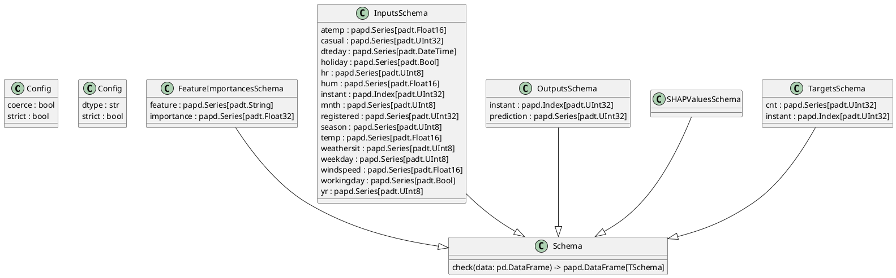

# US [Scchemas](./backlog_mlops_regresion.md) : Define structured data formats for input, output, and intermediate processes, ensuring consistency and validation throughout the pipeline.

- [Uml diagram of the package](#uml-diagram-of-the-package)
- [Code location](#code-location)
- [Test location](#test-location)

------------

## Uml diagram of the package

## Code location

[src/model_name/core/models.py](../src/model_name/core/schemas.py)

## Test location

[tests/core/test_models.py](../tests/core/schemas.py)