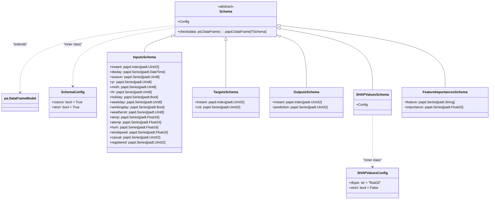

# US [Scchemas](./backlog_mlops_regresion.md) : Define structured data formats for input, output, and intermediate processes, ensuring consistency and validation throughout the pipeline

- [US Scchemas : Define structured data formats for input, output, and intermediate processes, ensuring consistency and validation throughout the pipeline](#us-scchemas--define-structured-data-formats-for-input-output-and-intermediate-processes-ensuring-consistency-and-validation-throughout-the-pipeline)
  - [classes relations](#classes-relations)
  - [**User Story: Define and Validate DataFrame Schemas with Pandera**](#user-story-define-and-validate-dataframe-schemas-with-pandera)
  - [**User Story: Define and Validate SHAP Values and Feature Importances Schemas**](#user-story-define-and-validate-shap-values-and-feature-importances-schemas)
  - [Code location](#code-location)
  - [Test location](#test-location)

------------

## classes relations

## **User Story: Define and Validate DataFrame Schemas with Pandera**

---

**Title:**  
As a **data engineer**, I want to define and validate schemas for data inputs, targets, and outputs, so that I can ensure data consistency and integrity throughout the pipeline.

---

**Description:**  
The implementation uses `pandera` to define strict schemas for validating input, target, and output data in a machine learning project. These schemas enforce data type constraints, allowable ranges, and values to prevent errors and ensure that the data meets expected requirements before being processed by the model.  

---

**Acceptance Criteria:**  

1. **Base Schema Class (`Schema`)**  
   - Provides a configurable foundation for all schemas with default settings:  
     - `coerce=True`: Automatically convert data types if possible.  
     - `strict=True`: Enforce exact column specifications.  
   - Implements a `check` method to validate a DataFrame and ensure compliance with the schema.

2. **Input Schema (`InputsSchema`)**  
   - Defines the structure and constraints for input data, including:  
     - Index:  
       - `instant`: Unsigned 32-bit integers (`UInt32`), greater than or equal to 0.  
     - Columns:  
       - `dteday`: DateTime objects.  
       - `season`: UInt8 values, limited to 1–4.  
       - `yr`: UInt8 values, limited to 0–1.  
       - `mnth`: UInt8 values, limited to 1–12.  
       - `hr`: UInt8 values, limited to 0–23.  
       - Boolean fields: `holiday`, `workingday`.  
       - `weekday`: UInt8 values, limited to 0–6.  
       - `weathersit`: UInt8 values, limited to 1–4.  
       - Continuous features (`Float16`) ranging from 0 to 1: `temp`, `atemp`, `hum`, `windspeed`.  
       - Count features (`UInt32`), greater than or equal to 0: `casual`, `registered`.  

3. **Target Schema (`TargetsSchema`)**  
   - Defines the structure and constraints for target data:  
     - Index:  
       - `instant`: Unsigned 32-bit integers (`UInt32`), greater than or equal to 0.  
     - Columns:  
       - `cnt`: Unsigned 32-bit integers (`UInt32`), greater than or equal to 0.  

4. **Output Schema (`OutputsSchema`)**  
   - Defines the structure and constraints for model outputs:  
     - Index:  
       - `instant`: Unsigned 32-bit integers (`UInt32`), greater than or equal to 0.  
     - Columns:  
       - `prediction`: Unsigned 32-bit integers (`UInt32`), greater than or equal to 0.  

5. **Validation**  
   - Ensure that DataFrame objects can be validated against their respective schemas using the `check` method.  
   - Verify that invalid data types, out-of-range values, or missing columns raise appropriate validation errors.  

6. **Testing**  
   - Create unit tests for:  
     - Validating correct input, target, and output DataFrames.  
     - Handling of invalid DataFrames, such as missing columns or incorrect data types.  
     - Conversion of data types (e.g., coercing a `float` to `UInt32`).  

7. **Documentation**  
   - Provide clear docstrings for each schema class:  
     - Explain the purpose of the schema.  
     - Describe the constraints for each field.  
   - Include examples of how to validate a DataFrame using the `check` method.  

8. **Extensibility**  
   - Ensure the base `Schema` class can be extended for additional schemas in the future.  
   - Allow the addition of new fields or constraints without breaking existing functionality.  

---

**Definition of Done (DoD):**  

- The `Schema`, `InputsSchema`, `TargetsSchema`, and `OutputsSchema` classes are implemented and tested.  
- All test cases for schema validation pass successfully.  
- Documentation is complete with examples and usage instructions.  
- The schemas are integrated into the project pipeline, ensuring data consistency during model training and prediction.  

## **User Story: Define and Validate SHAP Values and Feature Importances Schemas**

---

**Title:**  
As a **data scientist**, I want to define and validate schemas for SHAP values and feature importances, so that I can ensure the integrity of model explainability data.

---

**Description:**  
This implementation introduces schemas for managing SHAP values and feature importances in a machine learning project. These schemas ensure that explainability-related data, such as SHAP values and feature importance scores, comply with defined structural and type constraints, enabling consistent and reliable reporting.

---

**Acceptance Criteria:**  

1. **SHAP Values Schema (`SHAPValuesSchema`)**  
   - Defines the structure for storing SHAP values associated with model predictions.  
   - **Default Configurations:**  
     - Data type (`dtype`) is set to `float32` for efficient storage and computation.  
     - `strict=False`: Allows additional, unexpected columns to be present in the DataFrame.  
   - Must allow validation of DataFrame objects containing SHAP values.  

2. **Feature Importances Schema (`FeatureImportancesSchema`)**  
   - Defines the structure for feature importance data.  
   - **Columns:**  
     - `feature`: Strings representing feature names.  
     - `importance`: Float32 values representing feature importance scores.  
   - Must enforce strict validation to ensure correct data types for feature importance data.

3. **Validation**  
   - Validate SHAP values and feature importance DataFrames against their respective schemas using the `check` method.  
   - Verify that invalid data, such as incorrect data types or missing required fields, raises appropriate validation errors.  

4. **Testing**  
   - Create unit tests to:  
     - Validate correct SHAP values and feature importance DataFrames.  
     - Test handling of invalid data, including:  
       - Missing columns.  
       - Incorrect data types.  
       - Extra columns (permitted only in `SHAPValuesSchema`).  

5. **Documentation**  
   - Provide clear docstrings for each schema class:  
     - Explain the purpose of the schema.  
     - Describe the constraints for each field.  
   - Include usage examples for validating SHAP values and feature importance DataFrames.  

6. **Integration**  
   - Ensure that the schemas are used in the pipeline for validating SHAP values and feature importance data during explainability computations.  

---

**Definition of Done (DoD):**  

- The `SHAPValuesSchema` and `FeatureImportancesSchema` classes are implemented and tested.  
- All test cases for schema validation pass successfully.  
- Documentation is complete, including examples and usage instructions.  
- The schemas are integrated into the explainability pipeline, ensuring consistent and validated data for SHAP values and feature importances.  

## Code location

[src/model_name/core/schemas.py](../src/model_name/core/schemas.py)

## Test location

[tests/core/test_schemas.py](../tests/core/schemas.py)
