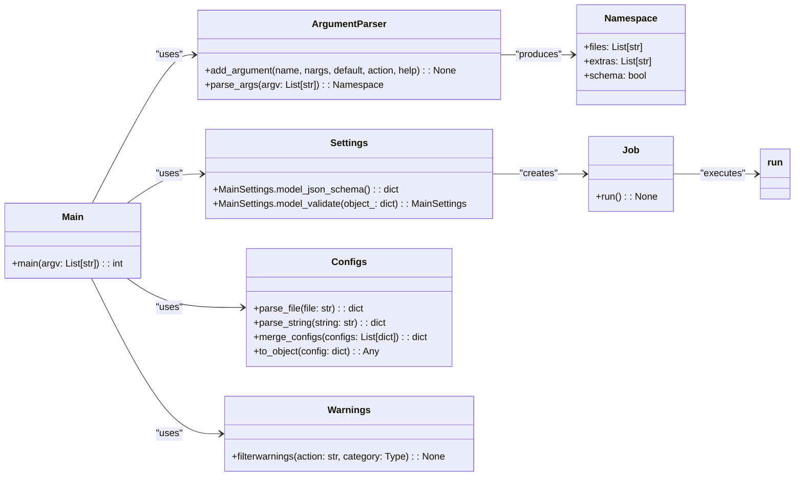

# US [CLI Application for Running AI/ML Jobs](./backlog_mlops_regresion.md) : Scripts for the CLI application

- [US CLI Application for Running AI/ML Jobs : Scripts for the CLI application](#us-cli-application-for-running-aiml-jobs--scripts-for-the-cli-application)
  - [classes relations](#classes-relations)
  - [**User Stories: CLI Application Management**](#user-stories-cli-application-management)
    - [**1. User Story: Parse Command-Line Arguments**](#1-user-story-parse-command-line-arguments)
    - [**2. User Story: Display Settings Schema**](#2-user-story-display-settings-schema)
    - [**3. User Story: Read Configuration Files**](#3-user-story-read-configuration-files)
    - [**4. User Story: Merge Configuration Settings**](#4-user-story-merge-configuration-settings)
    - [**5. User Story: Validate Configuration Settings**](#5-user-story-validate-configuration-settings)
    - [**6. User Story: Execute the Job**](#6-user-story-execute-the-job)
    - [**7. User Story: Handle No Configuration Provided**](#7-user-story-handle-no-configuration-provided)
    - [**Common Acceptance Criteria**](#common-acceptance-criteria)
    - [**Definition of Done (DoD):**](#definition-of-done-dod)
  - [Code location](#code-location)
  - [Test location](#test-location)

------------

## classes relations

## **User Stories: CLI Application Management**

---

### **1. User Story: Parse Command-Line Arguments**

**Title:**  
As a **user**, I want to provide job configuration files and options via command-line arguments, so that I can execute AI/ML jobs conveniently from the terminal.

**Description:**  
The CLI script parses command-line arguments to take in configuration files and other options.

**Acceptance Criteria:**  

- The script successfully retrieves job configuration files and additional strings from the command-line input.
- Help instructions are clearly available when required by the user.

---

### **2. User Story: Display Settings Schema**

**Title:**  
As a **developer**, I want to view the settings schema, so that I can understand the structure and requirements of configuration files.

**Description:**  
The CLI application can output the settings schema as JSON when the `--schema` flag is used.

**Acceptance Criteria:**  

- The schema is printed in JSON format with correct indentation when invoked.
- The application exits successfully after displaying the schema.

---

### **3. User Story: Read Configuration Files**

**Title:**  
As a **user**, I want the application to read configuration files in YAML or JSON, so that I can specify my job settings in a structured format.

**Description:**  
The CLI script reads specified configuration files and parses their contents to configure the job properly.

**Acceptance Criteria:**  

- The script can read and parse configuration files without errors.
- The settings gathered from files are stored correctly for further processing.

---

### **4. User Story: Merge Configuration Settings**

**Title:**  
As a **user**, I want to combine settings from both files and command-line strings, so that I can customize my job configurations more flexibly.

**Description:**  
The CLI application merges configurations from multiple sources (files and strings) into a single config object.

**Acceptance Criteria:**  

- The merging process combines settings appropriately without conflicts.
- The final configuration object accurately reflects the merged settings.

---

### **5. User Story: Validate Configuration Settings**

**Title:**  
As a **user**, I want to validate my configuration settings, so I can ensure they conform to the expected structure before running a job.

**Description:**  
The application validates the combined configuration settings against a predefined model.

**Acceptance Criteria:**  

- The settings are validated, and any discrepancies trigger clear error messages.
- Proper messages are presented if validation is successful.

---

### **6. User Story: Execute the Job**

**Title:**  
As a **user**, I want the application to execute the AI/ML job based on the provided configurations, so that I can carry out the intended operations.

**Description:**  
The CLI invokes the job runner, executing the task as described by the gathered configurations.

**Acceptance Criteria:**  

- The job is executed successfully when appropriate configurations are provided.
- Log messages indicate progress and completion of the job.

---

### **7. User Story: Handle No Configuration Provided**

**Title:**  
As a **user**, I want clear feedback if no configurations are provided, so that I can correct my input and try again.

**Description:**  
The application checks if any configurations have been provided and raises an error if none are present.

**Acceptance Criteria:**  

- A RuntimeError is raised when both configuration files and command-line strings are absent.
- The error message clearly informs the user of the missing configurations.

---

### **Common Acceptance Criteria**

1. **Implementation Requirements:**
   - The CLI application parses arguments correctly, handles files, and executes tasks.
   - Clear help instructions are provided as part of the command-line interface.

2. **Error Handling:**
   - Meaningful error messages guide the user in case of issues like missing configurations or validation errors.

3. **Testing:**
   - Unit tests validate command-line parsing, configuration reading, merging, validation, and job execution.
   - Tests ensure effective handling of edge cases related to configurations.

4. **Documentation:**
   - Clear and comprehensive docstrings are included for each method and class.
   - Users are provided with examples to understand how to use the command-line interface effectively.

---

### **Definition of Done (DoD):**

- The CLI script is fully functional, allowing for the running of AI/ML jobs with various configurations.
- All user stories are tested, and acceptance criteria are met.
- Documentation is complete and easy to follow.

## Code location

[src/model_name/scripts.py](../src/model_name/scripts.py)

## Test location

[tests/cli/test_cli.py](../tests/test_scrpits.py)
