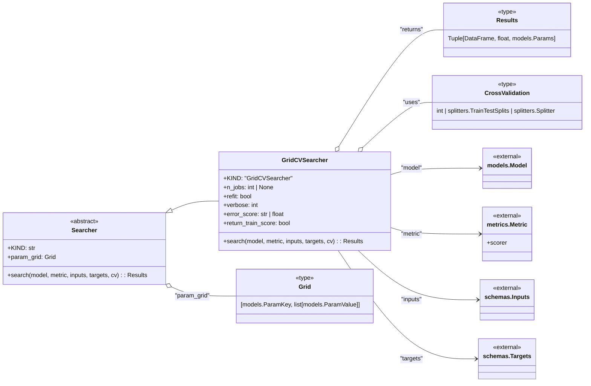

# US [Hyperparameter Searchers](./backlog_mlops_regresion.md) : Define functionalities for finding the best hyperparameters for a model.

- [US Hyperparameter Searchers : Define functionalities for finding the best hyperparameters for a model.](#us-hyperparameter-searchers--define-functionalities-for-finding-the-best-hyperparameters-for-a-model)
  - [classes relations](#classes-relations)
  - [**User Stories: Searcher Management**](#user-stories-searcher-management)
    - [**1. User Story: Configure Searcher**](#1-user-story-configure-searcher)
    - [**2. User Story: Execute Hyperparameter Search**](#2-user-story-execute-hyperparameter-search)
    - [**3. User Story: Collect Search Results**](#3-user-story-collect-search-results)
    - [**4. User Story: Identify Best Hyperparameters**](#4-user-story-identify-best-hyperparameters)
    - [**Common Acceptance Criteria**](#common-acceptance-criteria)
    - [**Definition of Done (DoD):**](#definition-of-done-dod)
  - [Code location](#code-location)
  - [Test location](#test-location)

------------

## classes relations

## **User Stories: Searcher Management**

---

### **1. User Story: Configure Searcher**

**Title:**  
As a **data scientist**, I want to configure a hyperparameter searcher with a parameter grid, so that I can optimize the performance of my machine learning model.

**Description:**  
The `Searcher` class serves as a base for defining parameter grids used in hyperparameter tuning, allowing customization of search strategies.

**Acceptance Criteria:**  
- The configuration allows for a parameter grid to be specified at initialization.
- The searcher instance accurately reflects the provided parameters.

---

### **2. User Story: Execute Hyperparameter Search**

**Title:**  
As a **data scientist**, I want to execute a hyperparameter search using the configured searcher, so that I can find the optimal hyperparameters for my model.

**Description:**  
The `search` method of a searcher class (e.g., `GridCVSearcher`) is called to perform the hyperparameter optimization process.

**Acceptance Criteria:**  
- The search process runs without errors and utilizes the training data.
- The searcher effectively integrates with the MLflow model and metrics used during evaluation.

---

### **3. User Story: Collect Search Results**

**Title:**  
As a **data scientist**, I want to collect the results from the hyperparameter search, so that I can analyze the performance of different hyperparameter configurations.

**Description:**  
The results from the search include a DataFrame with cross-validation scores and other relevant metrics.

**Acceptance Criteria:**  
- The job retrieves results in the expected format after executing the search.
- The search results include performance metrics for each parameter configuration.

---

### **4. User Story: Identify Best Hyperparameters**

**Title:**  
As a **data scientist**, I want to identify the best-performing hyperparameters from the search results, so that I can finalize my model configuration.

**Description:**  
The searcher should return the best score and the corresponding hyperparameters after completing the search.

**Acceptance Criteria:**  
- The best hyperparameters and their scores are easily accessible after the search.
- Clearly logged parameters should reflect the optimal configuration for the model.

---

### **Common Acceptance Criteria**

1. **Implementation Requirements:**
   - The `Searcher` class is appropriately abstract, with subclasses implementing the `search` method.
   - The configuration settings should allow customization for the search process.

2. **Error Handling:**
   - Any errors encountered during the search process should be logged with appropriate messages.
   - Validations for input data and parameters should occur before the search process starts.

3. **Testing:**
   - Unit tests validate the functionality of the searchers, ensuring that they can run searches and return results correctly.
   - Edge cases related to parameter configurations should be included in the tests.

4. **Documentation:**
   - Each class and method should include comprehensive docstrings explaining their purposes and functionalities.
   - Clear examples demonstrating how to utilize the searchers should be provided for users.

---

### **Definition of Done (DoD):** 

- The `TuningJob` class and all associated searcher functionality are implemented as outlined.
- All user stories are reflected in the implemented code and tested.
- The documentation is comprehensive, including usage instructions and examples.

## Code location

[src/model_name/utils/searchers.py](../src/model_name/utils/searchers.py)

## Test location

[tests/utils/test_searchers.py](../tests/utils/test_searchers.py)
