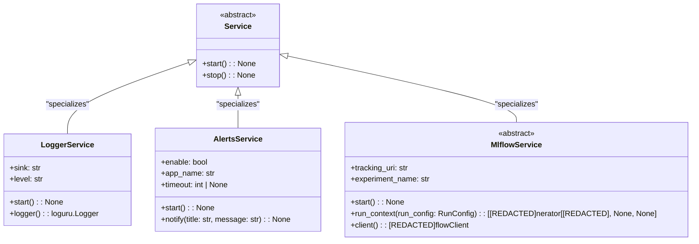

# US [Global Context Management](./backlog_mlops_regresion.md) : Efficiently manage global context during the execution of machine learning workflows.

- [US Global Context Management : Efficiently manage global context during the execution of machine learning workflows.](#us-global-context-management--efficiently-manage-global-context-during-the-execution-of-machine-learning-workflows)
  - [Classes Relations](#classes-relations)
  - [**User Stories: Service Management**](#user-stories-service-management)
    - [**1. User Story: Start a Global Service**](#1-user-story-start-a-global-service)
    - [**2. User Story: Stop a Global Service**](#2-user-story-stop-a-global-service)
  - [**User Stories: Logger Service**](#user-stories-logger-service)
    - [**1. User Story: Log Messages with Logger Service**](#1-user-story-log-messages-with-logger-service)
    - [**2. User Story: Configure Logger Service**](#2-user-story-configure-logger-service)
  - [**User Stories: Alerts Service**](#user-stories-alerts-service)
    - [**1. User Story: Send Notifications with Alerts Service**](#1-user-story-send-notifications-with-alerts-service)
  - [**User Stories: Mlflow Service**](#user-stories-mlflow-service)
    - [**1. User Story: Configure Mlflow Tracking Service**](#1-user-story-configure-mlflow-tracking-service)
    - [**2. User Story: Use Mlflow Run Context**](#2-user-story-use-mlflow-run-context)
  - [Code location](#code-location)
  - [Test location](#test-location)

------------

## Classes Relations

## **User Stories: Service Management**

---

### **1. User Story: Start a Global Service**

**Title:**  
As a **system administrator**, I want to start global services so that necessary resources are initialized to support my application's execution.

**Description:**  
The `Service` class serves as the base for managing global context through subclasses like `LoggerService`, `AlertsService`, and `MlflowService`. Each service must implement the `start` method to initialize their respective functionalities properly.

**Acceptance Criteria:**  
- The `start` method of specific services initializes all necessary configurations.
- The context of the global service must be accessible throughout the application lifecycle.
- No exceptions should be raised during initialization unless severe errors occur.

---

### **2. User Story: Stop a Global Service**

**Title:**  
As a **system administrator**, I want to stop global services so that I can clean up resources and avoid memory leaks.

**Description:**  
The `stop` method in the `Service` class is intended to gracefully release any global resources when the application execution is complete.

**Acceptance Criteria:**  
- The global services can be stopped without errors, indicating that resources are cleaned up.
- Any necessary logging of the stop operation is performed for audit purposes.

---

## **User Stories: Logger Service**

---

### **1. User Story: Log Messages with Logger Service**

**Title:**  
As a **developer**, I want to log messages using the Logger Service to track information and errors during application execution.

**Description:**  
The `LoggerService` provides functionalities to log messages with various levels (DEBUG, INFO, ERROR) to different outputs (like stderr or files).

**Acceptance Criteria:**  
- The logger captures messages of various severity levels correctly.
- The log output format aligns with the specified configuration.
- The application can retrieve the logger instance for usage at any point in execution.

---

### **2. User Story: Configure Logger Service**

**Title:**  
As a **developer**, I want to configure the Logger Service so that I can customize the logging behavior for my application.

**Description:**  
The configuration parameters (like logging level, output sink, and format) allow developers to tailor the logging service to meet specific needs.

**Acceptance Criteria:**  
- Configuration options can be specified at initialization and successfully applied.
- Users can customize at least the sink, level, and format of log messages before starting the Logger Service.

---

## **User Stories: Alerts Service**

---

### **1. User Story: Send Notifications with Alerts Service**

**Title:**  
As a **user**, I want to receive notifications on important events so that I can be promptly informed of critical actions taken by the application.

**Description:**  
The `AlertsService` allows for sending notifications to the system or console and manages user alerts based on specific criteria.

**Acceptance Criteria:**  
- Notifications are sent successfully with correct formatting.
- Users can toggle notifications on or off.
- Notifications contain a title and message.

---

## **User Stories: Mlflow Service**

---

### **1. User Story: Configure Mlflow Tracking Service**

**Title:**  
As a **data scientist**, I want to configure the Mlflow tracking service to ensure my model training runs are tracked properly.

**Description:**  
The `MlflowService` manages the setup required for tracking experiments, including configuring logging parameters.

**Acceptance Criteria:**  
- The service initializes the tracking URI and experiment settings on start.
- Configuration parameters (logging and registry settings) must function as intended without raising errors.

---

### **2. User Story: Use Mlflow Run Context**

**Title:**  
As a **data scientist**, I want to manage my experiments using a MLflow run context to ensure my runs are tracked accurately.

**Description:**  
The `run_context` method in `MlflowService` facilitates managing the lifecycle of an MLflow run, encapsulating the logging actions within a defined context.

**Acceptance Criteria:**  
- Users can enter a contextual block that automatically logs the start and end of a run.
- Relevant parameters (like name, tags, and description) are correctly logged against the experiment.

---

## Code location

[src/model_name/io/registries.py](../src/model_name/io/registries.py)

## Test location

[tests/io/test_registries.py](../tests/io/test_registries.py)
