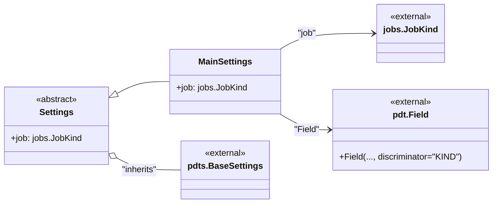

# US [Application Settings Management](./backlog_mlops_regresion.md) : Define settings for the application.

- [US Application Settings Management : Define settings for the application.](#us-application-settings-management--define-settings-for-the-application)
  - [classes relations](#classes-relations)
  - [**User Stories: Settings Management**](#user-stories-settings-management)
    - [**1. User Story: Configure Application Settings**](#1-user-story-configure-application-settings)
    - [**2. User Story: Define Job Settings**](#2-user-story-define-job-settings)
    - [**3. User Story: Validate Settings Structure**](#3-user-story-validate-settings-structure)
    - [**4. User Story: Separate Settings from Provider**](#4-user-story-separate-settings-from-provider)
    - [**Common Acceptance Criteria**](#common-acceptance-criteria)
    - [**Definition of Done (DoD):**](#definition-of-done-dod)
  - [Code location](#code-location)

------------

## classes relations



## **User Stories: Settings Management**

---

### **1. User Story: Configure Application Settings**

**Title:**  
As an **application administrator**, I want to configure application settings, so that I can adjust how the application behaves according to different execution contexts.

**Description:**  
The `Settings` class encapsulates high-level preferences for the application, allowing configurable parameters that influence job execution.

**Acceptance Criteria:**  
- The settings class can be instantiated with various configurations needed for the application.
- Default values are handled correctly, and the settings can be overridden.

---

### **2. User Story: Define Job Settings**

**Title:**  
As a **data scientist**, I want to specify the job to run within the main settings, so that I can ensure the correct job is executed based on the application's context.

**Description:**  
The `MainSettings` class holds the configuration for the job to be executed, ensuring that it is readily accessible when the application runs.

**Acceptance Criteria:**  
- The job is specified within the `MainSettings` and reflects the expected type.
- The job configuration can be validated against the expected structure before execution.

---

### **3. User Story: Validate Settings Structure**

**Title:**  
As a **developer**, I want to validate the application settings structure, so that I can ensure all required parameters are present and correct before the application runs.

**Description:**  
The settings classes use Pydantic to automatically validate the structure of the settings against predefined schemas.

**Acceptance Criteria:**  
- Validation occurs at instantiation, ensuring required parameters are not missing.
- Clear error messages are raised for any discrepancies in the settings structure.

---

### **4. User Story: Separate Settings from Provider**

**Title:**  
As a **developer**, I want to keep settings separate from their providers (e.g., command-line interface), so that I can maintain a clean and organized codebase.

**Description:**  
By defining settings as a distinct class, the application can cleanly interface with different configuration sources (e.g., CLI, files) while keeping the settings validation and application separate.

**Acceptance Criteria:**  
- The settings are decoupled from the underlying logic of the application so that changes in one do not directly impact the other.
- The architecture allows for easy swapping of settings providers without extensive code changes.

---

### **Common Acceptance Criteria**

1. **Implementation Requirements:**
   - The `Settings` and `MainSettings` classes must properly inherit from Pydantic's base settings.
   - Required parameters in the settings must be defined with appropriate types.

2. **Error Handling:**
   - Informative error messages should be provided if settings validation fails.
   - The application should handle missing or invalid settings gracefully, preventing runtime errors.

3. **Testing:**
   - Unit tests validate settings initialization, validation, and any provided default values.
   - Tests should ensure various scenarios where settings are provided through different sources are handled correctly.

4. **Documentation:**
   - Each class and method should include detailed docstrings explaining their purpose and usage.
   - Users should have access to examples that demonstrate the integration of settings into the application.

---

### **Definition of Done (DoD):** 

- The `Settings` and `MainSettings` classes are fully implemented with all respective functionalities.
- All user stories are verified through testing and meet acceptance criteria.
- Comprehensive documentation accompanies the code.

## Code location

[src/model_name/settings.py](../src/model_name/settings.py)

```