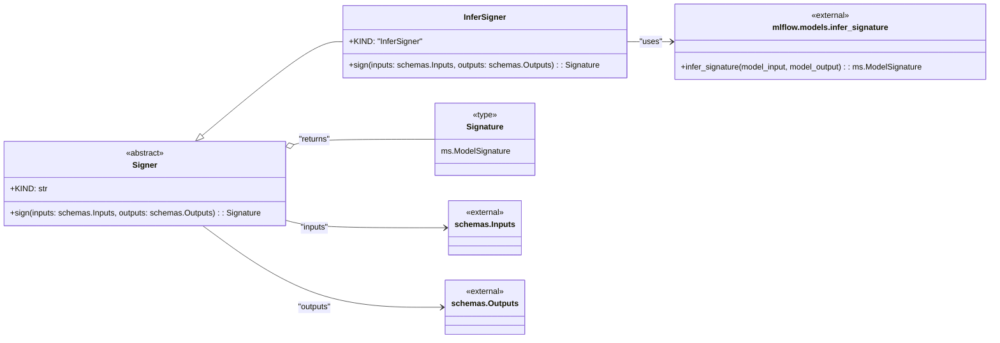

# US [Model Signature Generation](./backlog_mlops_regresion.md) : Generate signatures for AI/ML models.

- [US Model Signature Generation : Generate signatures for AI/ML models.](#us-model-signature-generation--generate-signatures-for-aiml-models)
  - [classes relations](#classes-relations)
  - [**User Stories: Signer Management**](#user-stories-signer-management)
    - [**1. User Story: Configure Model Signer**](#1-user-story-configure-model-signer)
    - [**2. User Story: Generate Model Signatures**](#2-user-story-generate-model-signatures)
    - [**3. User Story: Implement Signature Inference**](#3-user-story-implement-signature-inference)
    - [**Common Acceptance Criteria**](#common-acceptance-criteria)
    - [**Definition of Done (DoD):**](#definition-of-done-dod)
  - [Code location](#code-location)
  - [Test location](#test-location)

------------

## classes relations

## **User Stories: Signer Management**

---

### **1. User Story: Configure Model Signer**

**Title:**  
As a **data scientist**, I want to configure a model signer to generate the model signatures, so that I can validate input and output formats after training.

**Description:**  
The `Signer` abstract class allows for creating different signing strategies for models, enabling flexibility in how signatures are generated.

**Acceptance Criteria:**  
- The signer class can be configured with specific signing strategies.
- Default implementations may be available while allowing users to define custom strategies.

---

### **2. User Story: Generate Model Signatures**

**Title:**  
As a **data engineer**, I want to generate model signatures based on the input and output structures, so that I can ensure the integrity of model interfaces.

**Description:**  
The `sign` method of the `Signer` class generates a model signature using the provided inputs and outputs.

**Acceptance Criteria:**  
- The method accurately captures the information from inputs and outputs to create the signature.
- The generated signature is usable in downstream applications, such as model deployment or tracking.

---

### **3. User Story: Implement Signature Inference**

**Title:**  
As a **data scientist**, I want to use the built-in inference capabilities to automatically generate signatures from model inputs and outputs, so I can simplify the signature generation process.

**Description:**  
The `InferSigner` class provides functionality that leverages the MLflow library to automatically infer signatures based on the model's data.

**Acceptance Criteria:**  
- Model signatures are generated accurately using the `InferSigner` strategy.
- The inference correctly captures the structure of both inputs and outputs based on the received data.

---

### **Common Acceptance Criteria**

1. **Implementation Requirements:**
   - The `Signer` and its child classes are structured in a way that supports flexibility and extensibility of signing strategies.
   - Clear abstractions are provided for signing methods to ensure consistent interface usage.

2. **Error Handling:**
   - Any issues encountered during the signature generation process are logged, with informative messages describing the nature of the error.

3. **Testing:**
   - Unit tests validate the creation and functionality of different signer implementations.
   - Tests ensure that signatures reflect accurately based on provided inputs and outputs.

4. **Documentation:**
   - Each method and class should contain comprehensive docstrings to describe how they function.
   - Examples demonstrating how to use both `Signer` and `InferSigner` should be included for user guidance.

---

### **Definition of Done (DoD):** 

- The `Signer` and `InferSigner` classes are fully implemented and functioning as intended.
- All user stories are tested, and acceptance criteria are met.
- Documentation is comprehensive and provides clear instructions on how to utilize signing functionality.

## Code location

[src/model_name/utils/signers.py](../src/model_name/utils/signers.py)

## Test location

[tests/utils/test_signers.py](../tests/utils/test_signers.py)
