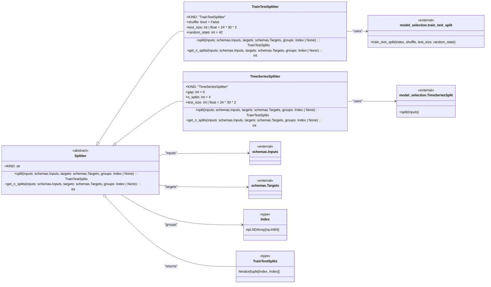

# US [Data Splitting Functionality](./backlog_mlops_regresion.md) : Split dataframes into subsets for model training and evaluation.

- [US Data Splitting Functionality : Split dataframes into subsets for model training and evaluation.](#us-data-splitting-functionality--split-dataframes-into-subsets-for-model-training-and-evaluation)
  - [classes relations](#classes-relations)
  - [**User Stories: Splitter Management**](#user-stories-splitter-management)
    - [**1. User Story: Configure Splitter**](#1-user-story-configure-splitter)
    - [**2. User Story: Split Data into Train and Test Sets**](#2-user-story-split-data-into-train-and-test-sets)
    - [**3. User Story: Split Data for Time Series Analysis**](#3-user-story-split-data-for-time-series-analysis)
    - [**4. User Story: Get Number of Splits**](#4-user-story-get-number-of-splits)
    - [**Common Acceptance Criteria**](#common-acceptance-criteria)
    - [**Definition of Done (DoD):**](#definition-of-done-dod)
  - [Code location](#code-location)
  - [Test location](#test-location)

------------

## classes relations

## **User Stories: Splitter Management**

---

### **1. User Story: Configure Splitter**

**Title:**  
As a **data scientist**, I want to configure a splitter that defines how datasets are divided into training and testing subsets, so that I can ensure proper model evaluation.

**Description:**  
The `Splitter` class serves as the base to specify configurations for splitting datasets according to the chosen method (train/test or time series).

**Acceptance Criteria:**  
- A splitter can be instantiated with specific parameters for splitting datasets.
- Default values are handled and configurable through initialization.

---

### **2. User Story: Split Data into Train and Test Sets**

**Title:**  
As a **data engineer**, I want to split datasets into training and testing sets using the specified Splitter, so that I can prepare them for model training and evaluation.

**Description:**  
The `TrainTestSplitter` allows for a straightforward split between the training and testing datasets based on the parameters provided.

**Acceptance Criteria:**  
- The job successfully divides input and target datasets into train and test subsets.
- The shapes of the resulting datasets are logged for verification.

---

### **3. User Story: Split Data for Time Series Analysis**

**Title:**  
As a **data scientist**, I want to use the `TimeSeriesSplitter` to split datasets specifically for time series analysis, so that temporal dependencies are respected in the splits.

**Description:**  
The `TimeSeriesSplitter` class creates fixed-time subsets of the data, allowing for model evaluation that maintains time order.

**Acceptance Criteria:**  
- The time series data is split according to specified parameters without shuffling.
- The results accurately reflect the required time splits in the dataset.

---

### **4. User Story: Get Number of Splits**

**Title:**  
As a **data scientist**, I want to retrieve the number of splits generated by the splitter class, so that I can understand how many distinct training/test sets will be produced.

**Description:**  
Both the `TrainTestSplitter` and `TimeSeriesSplitter` should provide the number of splits available for model training.

**Acceptance Criteria:**  
- The method to get the number of splits returns an integer count accurately representing the available splits.
- The information should be logged for reference during the training process.

---

### **Common Acceptance Criteria**

1. **Implementation Requirements:**
   - The `Splitter`, `TrainTestSplitter`, and `TimeSeriesSplitter` classes must properly define their respective methods.
   - Interfaces for splitting and returning the number of splits should be consistent across all implementations.

2. **Error Handling:**
   - Errors encountered during data splitting should be logged with clear messages, especially when invalid data is provided.

3. **Testing:**
   - Unit tests validate each splitter's functionality, confirming that datasets are split correctly based on the modes specified.
   - Edge cases regarding splitting configurations should also be included in the tests.

4. **Documentation:**
   - Each class and method should contain thorough docstrings describing their intended use and how to interact with them.
   - Examples of initializing and using each splitter should be included for user reference.

---

### **Definition of Done (DoD):** 

- The `Splitter`, `TrainTestSplitter`, and `TimeSeriesSplitter` classes are fully functional and meet the outlined acceptance criteria.
- All functionalities are verified through testing, ensuring reliability in data splits.
- Documentation is complete, providing clarity for integration and use.

## Code location

[src/model_name/utils/splitters.py](../src/model_name/utils/splitters.py)

## Test location

[tests/utils/test_splitters.py](../tests/utils/test_splitters.py)
