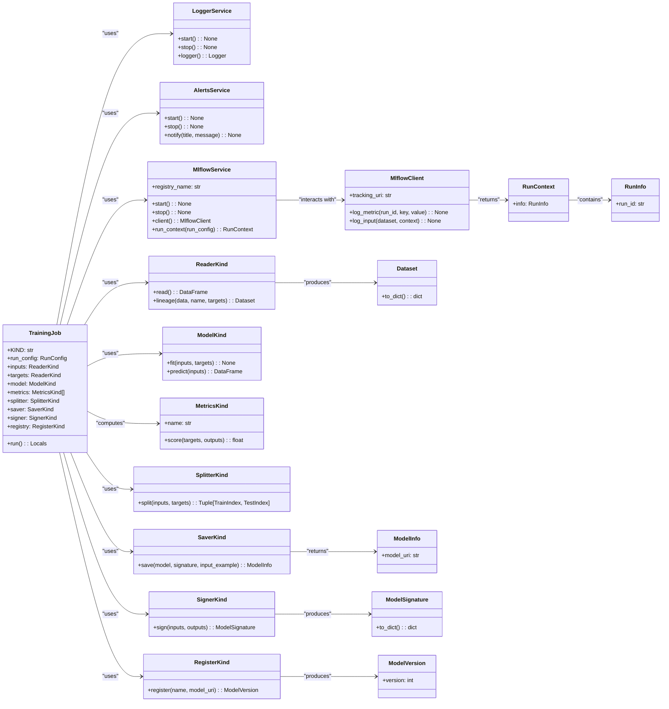

# US [Model Training Job](./backlog_mlops_regresion.md) : Define a job for training and registering a single AI/ML model

- [US Model Training Job : Define a job for training and registering a single AI/ML model](#us-model-training-job--define-a-job-for-training-and-registering-a-single-aiml-model)
  - [classes relations](#classes-relations)
  - [**User Stories: Training Job Management**](#user-stories-training-job-management)
    - [**1. User Story: Configure Training Job**](#1-user-story-configure-training-job)
    - [**2. User Story: Read Input and Target Data**](#2-user-story-read-input-and-target-data)
    - [**3. User Story: Log Data Lineage**](#3-user-story-log-data-lineage)
    - [**4. User Story: Split Data for Training and Testing**](#4-user-story-split-data-for-training-and-testing)
    - [**5. User Story: Fit the Model**](#5-user-story-fit-the-model)
    - [**6. User Story: Generate Predictions**](#6-user-story-generate-predictions)
    - [**7. User Story: Calculate Metrics**](#7-user-story-calculate-metrics)
    - [**8. User Story: Sign the Model**](#8-user-story-sign-the-model)
    - [**9. User Story: Save the Model**](#9-user-story-save-the-model)
    - [**10. User Story: Register the Model**](#10-user-story-register-the-model)
    - [**11. User Story: Notify Completion of Training**](#11-user-story-notify-completion-of-training)
    - [**Common Acceptance Criteria**](#common-acceptance-criteria)
    - [**Definition of Done (DoD):**](#definition-of-done-dod)
  - [Code location](#code-location)
  - [Test location](#test-location)

------------

## classes relations

## **User Stories: Training Job Management**

---

### **1. User Story: Configure Training Job**

**Title:**  
As a **data scientist**, I want to configure a training job with all necessary parameters for training a model, so that I can manage the model training process effectively.

**Description:**  
The `TrainingJob` class allows for setting up parameters such as input and target data readers, model configuration, metrics, data splitters, and methods to save, sign, and register the model.

**Acceptance Criteria:**  

- The job can be initialized with all required parameters.
- Defaults should be set for optional parameters where applicable.

---

### **2. User Story: Read Input and Target Data**

**Title:**  
As a **data engineer**, I want to read input and target datasets from specified sources, so that I can prepare them for training the model.

**Description:**  
The `run` method reads input and target data from configured sources, ensuring that the data is validated against predefined schemas.

**Acceptance Criteria:**  

- The job successfully reads and validates input and target datasets using their respective readers.
- The shapes of the datasets are logged for reference.

---

### **3. User Story: Log Data Lineage**

**Title:**  
As a **compliance officer**, I want to log the lineage of the input and target datasets, so that we can trace the data used in model training for auditing purposes.

**Description:**  
Lineage information for both the input and target datasets is logged using MLflow to provide visibility into the data utilized during model training.

**Acceptance Criteria:**  

- The lineage of both the input and target datasets is successfully logged in MLflow.
- Logged lineage includes necessary details to trace back the data source.

---

### **4. User Story: Split Data for Training and Testing**

**Title:**  
As a **data scientist**, I want to split the input and target datasets into training and testing subsets, so that I can evaluate the model's performance on unseen data.

**Description:**  
The job utilizes a defined splitter to partition the datasets into training and testing sets, facilitating effective model training and evaluation.

**Acceptance Criteria:**  

- The job splits the datasets into training and testing subsets based on the specified splitter.
- The shapes of the resulting training and testing sets are logged.

---

### **5. User Story: Fit the Model**

**Title:**  
As a **data scientist**, I want to fit the model using the training data, so that the model can learn from the provided examples.

**Description:**  
The training job invokes the model's fit method to train using the training data, preparing it for predictions.

**Acceptance Criteria:**  

- The model is successfully fitted with the training data.
- Any relevant training progress or metrics are logged for monitoring.

---

### **6. User Story: Generate Predictions**

**Title:**  
As a **data scientist**, I want to use the trained model to generate predictions on the test dataset, so that I can assess its performance.

**Description:**  
After training, the model is used to generate predictions on the unseen test dataset.

**Acceptance Criteria:**  

- Predictions are generated successfully for the test dataset.
- The shape of the predictions is logged for reference.

---

### **7. User Story: Calculate Metrics**

**Title:**  
As a **data scientist**, I want to evaluate the trained model's predictions using predefined metrics, so that I can measure its performance effectively.

**Description:**  
The job calculates specified metrics (e.g., accuracy, precision) using the model's predictions and the actual target values.

**Acceptance Criteria:**  

- Each metric is computed and logged with its corresponding score.
- The metrics must be correctly linked to the predictions and actual targets.

---

### **8. User Story: Sign the Model**

**Title:**  
As a **model manager**, I want to sign the trained model with metadata, so that we can verify and track its versions and characteristics easily.

**Description:**  
The trained model is signed using a specified signer to ensure that it captures the input-output relationship and any other pertinent details.

**Acceptance Criteria:**  

- The model is signed successfully, with the signature logged.
- The signature includes all necessary metadata like versioning info or model parameters.

---

### **9. User Story: Save the Model**

**Title:**  
As a **data engineer**, I want to save the trained model into a specified format, so that it can be reused in the future for making predictions or further evaluations.

**Description:**  
The job invokes the appropriate saver to store the model and its signature in a persistent storage solution.

**Acceptance Criteria:**  

- The trained model is successfully saved, and the model URI is logged for future reference.
- The saved model adheres to the defined specifications for the chosen format.

---

### **10. User Story: Register the Model**

**Title:**  
As a **model manager**, I want to register the trained model in the model registry, so that it can be tracked and used in subsequent deployments or evaluations.

**Description:**  
The job registers the model using a specified registry service, making it available in the model registry for future access.

**Acceptance Criteria:**  

- The model is successfully registered in the MLflow model registry.
- The model version is logged and confirmed as part of the registration process.

---

### **11. User Story: Notify Completion of Training**

**Title:**  
As a **user**, I want to receive a notification upon completion of the training job, so that I am informed about the results of the model's training and registration.

**Description:**  
At the conclusion of the job execution, the system sends a notification summarizing the training job results, including the registered model version.

**Acceptance Criteria:**  

- Notifications include a summary of job completion, along with the registered model version.
- The alerts system effectively communicates the status to relevant stakeholders.

---

### **Common Acceptance Criteria**

1. **Implementation Requirements:**
   - The `TrainingJob` class correctly implements the abstract `run` method from the base `Job` class.
   - All necessary services (logging, MLflow, alerts) are properly initialized.

2. **Error Handling:**
   - Any issues encountered during training, evaluation, model saving, or registration should trigger appropriate logging and error messaging.

3. **Testing:**
   - Unit tests validate job configuration, data reading, model training, metric calculations, model saving, and registration.
   - Tests ensure that error scenarios are identified and handled gracefully.

4. **Documentation:**
   - Each class and method should have comprehensive docstrings explaining their functionality.
   - Clear examples should be provided to guide users in configuring and running the training job.

---

### **Definition of Done (DoD):**

- The `TrainingJob` class is fully functional and adheres to all acceptance criteria.
- All job components, from data input to model registration, are tested and validated.
- Documentation is complete, providing a clear understanding for future users.

## Code location

[src/model_name/jobs/training.py](../src/model_name/jobs/training.py)

## Test location

[tests/jobs/test_training.py](../tests/jobs/test_training.py)
