# Backlog for Class Diagram Implementation

- [Backlog for Class Diagram Implementation](#backlog-for-class-diagram-implementation)
  - [**Features/packages**](#featurespackages)
    - [**FE: Core**](#fe-core)
    - [**FE: Input Outputs**](#fe-input-outputs)
    - [**FE: Jobs**](#fe-jobs)
    - [**FE: Utils**](#fe-utils)
    - [**FE: main**](#fe-main)
    - [**FE: Tasks for CI/CD**](#fe-tasks-for-cicd)
  - [UML packages relations](#uml-packages-relations)

---

## **Features/packages**

### **FE: Core**

   The foundational components of the system that ensure efficient functionality across various modules:

- **[US: Metrics](Metrics_stories.md)**: Provide standardized measurements for model performance, accuracy, and evaluation. Useful for tracking improvement and identifying bottlenecks.
- **[US: Models](Models_stories.md)**: Define the structure of machine learning models, including architectures and checkpoints, to standardize training and deployment.
- **[US: Schemas](Schemas_stories.md)**: Define structured data formats for input, output, and intermediate processes, ensuring consistency and validation throughout the pipeline.

### **FE: Input Outputs**

 Handle configuration, data ingestion, and external environment variables for seamless integration:

- **[US: Config](Configs_stories.md)**: Store and manage configuration files to customize and control the behavior of different modules.
- **[US: Dataset](Datasets_stories.md)**: Handle loading, preprocessing, and managing data sets for training, evaluation, and inference.
- **[US: OSVariables](OSvariables_stories.md)**: Provide environment variables and system-level configurations for portability across various environments.
- **[US: Registries](Regristries_stories.md)**: Maintain a central repository for tracking artifacts like models, datasets, and configurations.
- **[US: Services](Services_stories.md)**: Connect and integrate external or internal services such as APIs, databases, and message brokers.

### **FE: Jobs**

   Define and manage specific tasks and workflows for various stages in the machine learning lifecycle:

- **[US: Base](Base_stories.md)**: The foundational job configurations and implementations shared across all job types.
- **[US: Evaluations](Evaluations_stories.md)**: Execute performance tests and comparisons for models, ensuring they meet predefined criteria.
- **[US: Explanations](Explanations_stories.md)**: Generate explainability reports for machine learning models to provide insights into predictions and decisions.
- **[US: Inference](Inference_stories.md)**: Execute predictions using trained models, optimized for low latency and high throughput.
- **US: KafkaInference**: Specialized inference jobs designed to integrate with Kafka for real-time data streaming applications.
- **[US: Promotion](Promotions_stories.md)**: Automate the promotion of models from development to production environments, ensuring governance and validation.
- **[US: Training](Trainning_stories.md)**: Handle the full model training process, including data preparation, model fitting, and checkpointing.
- **[US: Tuning](Tuning_stories.md)**: Optimize hyperparameters and configurations to improve model performance systematically.

### **FE: Utils**
Auxiliary tools and configurations that enhance functionality and streamline development
- **[US: Searchers](Searchers_stories.md)**: Define functionalities for finding the best hyperparameters for a model.
- **[US: Signers](Signers_stories.md)**:  Generate signatures for AI/ML models.
- **[US: Splitters](Splitters_stories.md)**: Split dataframes into subsets for model training and evaluation. 

### **FE: main**
General execution scripts
- **[US. Scripts](Scripts_stories.md)**: Include utility scripts for automating tasks, data handling, and system management.
- **[US: Settings](Settings_stories.md)**: Centralize settings and constants used across different modules for consistency and maintainability.

### **FE: Tasks for CI/CD**

Break down operational processes into manageable, modular tasks

- **US: Checks**: Validate system and code integrity with automated checks for errors, standards, and best practices.
- **US: Cleans**: Perform data cleaning and preprocessing to ensure data quality and consistency.
- **US: Commits**: Automate code versioning and commit standards for collaborative development.
- **US: Containers**: Build and manage containerized environments for consistent deployments across platforms.
- **US: Docs**: Generate and maintain documentation for all modules, ensuring clear usage and collaboration.
- **US: Formats**: Enforce code formatting standards for readability and maintainability.
- **US: Installs**: Manage dependency installation for smooth setup across different environments.
- **US: MLFlow**: Integrate with MLFlow for experiment tracking, model registry, and deployment workflows.
- **US: Packages**: Organize and manage Python or other language packages for modularized codebases.
- **US: Projects**: Create and maintain projects, ensuring that each has the structure, configuration, and tools needed for success.

## UML packages relations

```mermaid
graph LR
    subgraph regression_model_template
    end
    subgraph regression_model_template.__main__
    end
    subgraph regression_model_template.core
    end
    subgraph regression_model_template.core.metrics
    end
    subgraph regression_model_template.core.models
    end
    subgraph regression_model_template.core.schemas
    end
    subgraph regression_model_template.io
    end
    subgraph regression_model_template.io.configs
    end
    subgraph regression_model_template.io.datasets
    end
    subgraph regression_model_template.io.osvariables
    end
    subgraph regression_model_template.io.registries
    end
    subgraph regression_model_template.io.services
    end
    subgraph regression_model_template.jobs
    end
    subgraph regression_model_template.jobs.base
    end
    subgraph regression_model_template.jobs.evaluations
    end
    subgraph regression_model_template.jobs.explanations
    end
    subgraph regression_model_template.jobs.inference
    end
    subgraph regression_model_template.jobs.kafkainference
    end
    subgraph regression_model_template.jobs.promotion
    end
    subgraph regression_model_template.jobs.training
    end
    subgraph regression_model_template.jobs.tuning
    end
    subgraph regression_model_template.scripts
    end
    subgraph regression_model_template.settings
    end
    subgraph regression_model_template.utils
    end
    subgraph regression_model_template.utils.searchers
    end
    subgraph regression_model_template.utils.signers
    end
    subgraph regression_model_template.utils.splitters
    end

    regression_model_template.__main__ --> regression_model_template
    regression_model_template.__main__ --> regression_model_template.scripts
    regression_model_template.core.metrics --> regression_model_template.core
    regression_model_template.core.metrics --> regression_model_template.core.models
    regression_model_template.core.metrics --> regression_model_template.core.schemas
    regression_model_template.core.models --> regression_model_template.core
    regression_model_template.core.models --> regression_model_template.core.schemas
    regression_model_template.io.registries --> regression_model_template.core
    regression_model_template.io.registries --> regression_model_template.core.models
    regression_model_template.io.registries --> regression_model_template.core.schemas
    regression_model_template.io.registries --> regression_model_template.utils
    regression_model_template.io.registries --> regression_model_template.utils.signers
    regression_model_template.io.services --> regression_model_template.io.osvariables
    regression_model_template.jobs --> regression_model_template.jobs.evaluations
    regression_model_template.jobs --> regression_model_template.jobs.explanations
    regression_model_template.jobs --> regression_model_template.jobs.inference
    regression_model_template.jobs --> regression_model_template.jobs.promotion
    regression_model_template.jobs --> regression_model_template.jobs.training
    regression_model_template.jobs --> regression_model_template.jobs.tuning
    regression_model_template.jobs.base --> regression_model_template.io
    regression_model_template.jobs.base --> regression_model_template.io.services
    regression_model_template.jobs.evaluations --> regression_model_template.core
    regression_model_template.jobs.evaluations --> regression_model_template.core.metrics
    regression_model_template.jobs.evaluations --> regression_model_template.core.schemas
    regression_model_template.jobs.evaluations --> regression_model_template.io
    regression_model_template.jobs.evaluations --> regression_model_template.io.datasets
    regression_model_template.jobs.evaluations --> regression_model_template.io.registries
    regression_model_template.jobs.evaluations --> regression_model_template.io.services
    regression_model_template.jobs.evaluations --> regression_model_template.jobs
    regression_model_template.jobs.evaluations --> regression_model_template.jobs.base
    regression_model_template.jobs.explanations --> regression_model_template.core
    regression_model_template.jobs.explanations --> regression_model_template.core.schemas
    regression_model_template.jobs.explanations --> regression_model_template.io
    regression_model_template.jobs.explanations --> regression_model_template.io.datasets
    regression_model_template.jobs.explanations --> regression_model_template.io.registries
    regression_model_template.jobs.explanations --> regression_model_template.jobs
    regression_model_template.jobs.explanations --> regression_model_template.jobs.base
    regression_model_template.jobs.inference --> regression_model_template.core
    regression_model_template.jobs.inference --> regression_model_template.core.schemas
    regression_model_template.jobs.inference --> regression_model_template.io
    regression_model_template.jobs.inference --> regression_model_template.io.datasets
    regression_model_template.jobs.inference --> regression_model_template.io.registries
    regression_model_template.jobs.inference --> regression_model_template.jobs
    regression_model_template.jobs.inference --> regression_model_template.jobs.base
    regression_model_template.jobs.promotion --> regression_model_template.jobs
    regression_model_template.jobs.promotion --> regression_model_template.jobs.base
    regression_model_template.jobs.training --> regression_model_template.core
    regression_model_template.jobs.training --> regression_model_template.core.metrics
    regression_model_template.jobs.training --> regression_model_template.core.models
    regression_model_template.jobs.training --> regression_model_template.core.schemas
    regression_model_template.jobs.training --> regression_model_template.io
    regression_model_template.jobs.training --> regression_model_template.io.datasets
    regression_model_template.jobs.training --> regression_model_template.io.registries
    regression_model_template.jobs.training --> regression_model_template.io.services
    regression_model_template.jobs.training --> regression_model_template.jobs
    regression_model_template.jobs.training --> regression_model_template.jobs.base
    regression_model_template.jobs.training --> regression_model_template.utils
    regression_model_template.jobs.training --> regression_model_template.utils.signers
    regression_model_template.jobs.training --> regression_model_template.utils.splitters
    regression_model_template.jobs.tuning --> regression_model_template.core
    regression_model_template.jobs.tuning --> regression_model_template.core.metrics
    regression_model_template.jobs.tuning --> regression_model_template.core.models
    regression_model_template.jobs.tuning --> regression_model_template.core.schemas
    regression_model_template.jobs.tuning --> regression_model_template.io
    regression_model_template.jobs.tuning --> regression_model_template.io.datasets
    regression_model_template.jobs.tuning --> regression_model_template.io.services
    regression_model_template.jobs.tuning --> regression_model_template.jobs
    regression_model_template.jobs.tuning --> regression_model_template.jobs.base
    regression_model_template.jobs.tuning --> regression_model_template.utils
    regression_model_template.jobs.tuning --> regression_model_template.utils.searchers
    regression_model_template.jobs.tuning --> regression_model_template.utils.splitters
    regression_model_template.scripts --> regression_model_template
    regression_model_template.scripts --> regression_model_template.io
    regression_model_template.scripts --> regression_model_template.io.configs
    regression_model_template.scripts --> regression_model_template.settings
    regression_model_template.settings --> regression_model_template
    regression_model_template.settings --> regression_model_template.jobs
    regression_model_template.utils.searchers --> regression_model_template.core
    regression_model_template.utils.searchers --> regression_model_template.core.metrics
    regression_model_template.utils.searchers --> regression_model_template.core.models
    regression_model_template.utils.searchers --> regression_model_template.core.schemas
    regression_model_template.utils.searchers --> regression_model_template.utils
    regression_model_template.utils.searchers --> regression_model_template.utils.splitters
    regression_model_template.utils.signers --> regression_model_template.core
    regression_model_template.utils.signers --> regression_model_template.core.schemas
    regression_model_template.utils.splitters --> regression_model_template.core
    regression_model_template.utils.splitters --> regression_model_template.core.schemas

```

